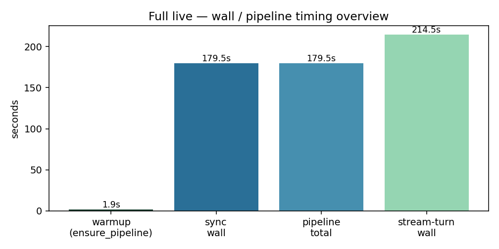
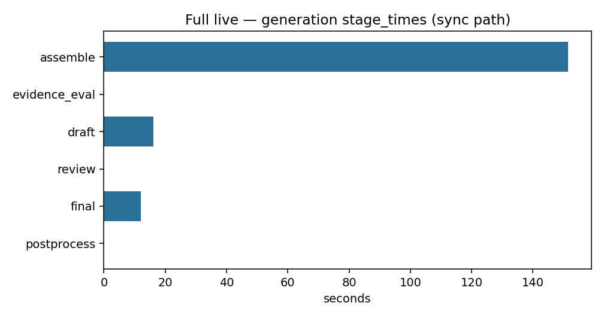
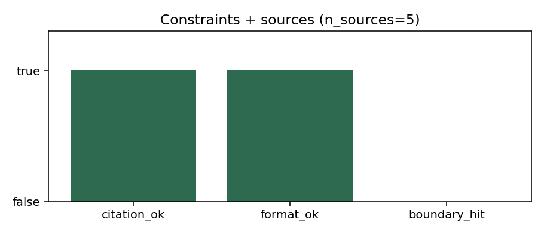
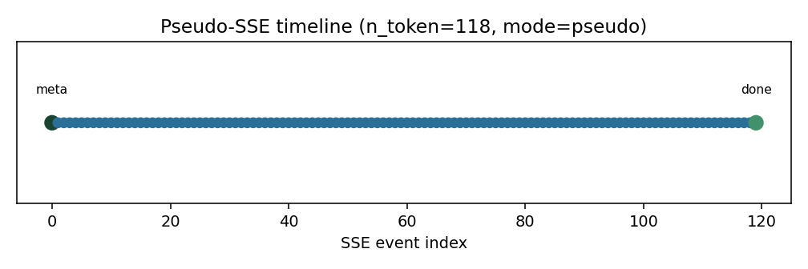

# 服务化与接口开发第一部分 — 报告

> **状态：已完成** — 阶段 0–4.5 / 5 全部通过（2026-07-25）  
> **对照依据**：[`任务.txt`](../任务.txt) · [`schedule.md`](../schedule.md) · [`api-smoke.ipynb`](../notebooks/api-smoke.ipynb) · [`full_api_smoke.json`](../outputs/reports/full_api_smoke.json)  
> **验证口径**：契约默认 **mock / sample**（pytest **41 passed**）；另附 **full + Ollama** 连通抽检（阶段 4.5，报告素材见 `outputs/reports/`）  
> **不包含**：真实鉴权落地、会话持久化 DB、Ollama token 级真流式、**产品级 Web 前端** / Docker 生产编排、改写 08/10 内核  
> **本阶段形态**：**HTTP API 后端 / 服务接入层**（`/` 返回 JSON 非 HTML；调试 UI 为 `/docs` Swagger）。前端接入契约见 **§3**。

---

## 1. 概述：本阶段在 RAG 里做什么

01–10 解决「会不会答、守不守规矩」；**11 解决「别人怎么稳定调用」**——用 FastAPI 把 10 的约束流水线（可回退 08）接到 HTTP / SSE。**不是**交付聊天网页；浏览器打开 `/`「空白」属预期（见笔记 Q7）。

| 上游 | 本阶段新增 |
|------|------------|
| 10 `ConstrainedGenerationPipeline.run` | `RagService` 懒加载单例；统一信封与错误码 |
| 单次 Python 调用 | `POST /api/v1/qa`（同步）· `POST /api/v1/qa/stream`（伪 SSE） |
| 无会话 | 内存 `SessionStore` + 可选 query 前缀注入 |
| 控制台日志 | `request_id` + `QACallLogger` JSONL |

餐厅比喻（与笔记 Q1 一致）：

```text
08 = 后厨会做菜
10 = 食品安全与出品安检
11 = 前台点餐系统（统一小票、拒单话术、探活、同步/流式出餐、桌号、流水账）
```

### 1.1 端到端数据流

```text
Client
  │  POST /api/v1/qa  { query, top_k?, session_id? }
  ▼
FastAPI（Pydantic 校验 · request_id · 异常统一）
  │  SessionStore 解析 / 新建
  ▼
RagService.answer
  │  → ConstrainedGenerationPipeline.from_mode(sample|full).run(effective_query)
  │  Ollama 失败 → 4001；其它 → 4002
  ▼
ResponseModel { code, message, data{answer,sources,session_id,constraint_checks,…}, request_id }
  + qa_calls.jsonl（request_id / latency_ms / status）

流式：POST /api/v1/qa/stream
  → 同源 answer 后伪切块 → SSE meta → token* → done（或 error）
  → meta.stream_mode = "pseudo"（非 Ollama 真 token 流）
```

### 1.2 验证范围

| 路径 | 怎么验 | 代表什么 |
|------|--------|----------|
| pytest 41 passed | mock pipeline / 契约 | API 信封、1001、会话、伪 SSE |
| Notebook C0–C4 | TestClient + mock | 与阶段同步的可复现演示 |
| C2 sample live | `RagService(sample)` + Ollama | 服务封装能打通小库 |
| **C4.5 full live** | `RagService(full)` + Ollama + 热身 HTTP | **生产数据路径连通**（本报告 §4） |

---

## 2. 任务书对照

> 源：`11 服务化与接口开发第一部分/任务.txt`

| 任务书条目 | 交付 | 代码落点 | Notebook | 状态 |
|------------|------|----------|----------|------|
| FastAPI 骨架 | 应用入口 + 启动脚本 | `app/main.py` · `scripts/run_api.py` | C0 | ✅ |
| `ResponseModel` + 分页模型 | 统一信封 | `app/schemas/response.py` | C1 | ✅ |
| 错误码枚举（1001/2001/3001/4001…） | `ErrorCode` + HTTP 映射 | `app/core/error_codes.py` | C1 | ✅ |
| 全局异常处理 | AppException / 422→**400+1001** | `app/core/exceptions.py` | C1 | ✅ |
| 日志 + 健康检查 | 中间件 · `/health` · `/ready` | `logging` / `middleware` / `api/health.py` | C0.5/C1 | ✅ |
| 同步问答 | `POST /api/v1/qa` | `app/api/qa.py` | C3 | ✅ |
| 流式问答 | `POST /api/v1/qa/stream`（伪 SSE） | `qa.py` · `sse_pseudo.py` | C4 | ✅ |
| **集成 RAG 流水线** | 默认挂 10 `from_mode` | `app/services/rag_service.py` | C2 / **C4.5** | ✅ |
| `session_id` 关联历史 | 内存 Store + query 前缀 | `session_store.py` | C2/C3 | ✅ |
| query / top_k 校验 | Pydantic + 1001 | `schemas/qa.py` | C3 | ✅ |
| 调用日志（request_id/耗时/状态） | JSONL（非强制 DB） | `qa_logger.py` | C3 / C4.5 | ✅ |

**口径说明**

| 任务书原话 | 本工程落地 | 原因 |
|------------|------------|------|
| 「流式响应模式」 | SSE + **`stream_mode=pseudo`** | 08 `LLMGenerator` 硬编码 `stream=False`；10 多步重试与真 token 流冲突大 |
| 「结合会话管理」 | 进程内 Store + TTL/`max_turns`；历史压成 query 前缀 | 08/10 `run(query)` 无 `session_history` |
| 「日志或数据库」 | **JSONL 文件** | 结构便于后续入库；本周不强制 DB |
| 「集成 RAG」 | `RagService` → 10；full 抽检见 §4 | C3/C4 mock 只验契约，不代表未集成 |

---

## 3. API 契约说明（本阶段成果 · 供前端接入）

> **机器可读契约**：运行服务后打开 [`/docs`](http://127.0.0.1:8000/docs)（Swagger）或 [`/openapi.json`](http://127.0.0.1:8000/openapi.json)。  
> 本节把契约整理成「前端同学可直接对接」的说明；与代码不一致时以运行中的 OpenAPI 为准。

### 3.1 阶段成果边界

| 已交付 | 未交付（留给前端 / 后续） |
|--------|---------------------------|
| JSON / SSE **HTTP API** | 聊天页、登录页、管理台等 **HTML UI** |
| 统一信封 `ResponseModel` + 业务错误码 | 鉴权（`2001` 仅预留） |
| 同步 QA + 伪流式 SSE（`stream_mode=pseudo`） | Ollama 真 token 流（将来可扩为 `token`；概念见笔记 Q4） |
| 进程内 `session_id` | 跨进程 / 持久化会话、用户账号体系 |
| `/docs` 开发者调试 UI | 面向患者/医生的产品前端 |

根路径 `GET /` 返回 **JSON 元信息**，不是网站首页——浏览器「白屏」但 Network 里是 `200` + JSON，属正常。

### 3.2 基址与通用约定

| 项 | 约定 |
|----|------|
| Base URL（本地） | `http://127.0.0.1:8000` |
| 内容类型（JSON 接口） | 请求 `Content-Type: application/json`；响应 `application/json` |
| 流式接口 | 响应 `Content-Type: text/event-stream` |
| 请求追踪 | 响应头 **`X-Request-Id`**（可主动传入同名请求头以透传）；另有 **`X-Response-Time-Ms`** |
| 业务成败 | 先看 body 里的 **`code`**（`0` = 成功），不要只看 HTTP 状态 |
| CORS | 本周**未**配置跨域；前端若分端口部署需后续加 `CORSMiddleware` 或同域反代 |
| 鉴权 | **无**；后续可加 `Authorization` 并映射 `code=2001` |

**统一成功 / 失败信封**（几乎所有 JSON 接口）：

```json
{
  "code": 0,
  "message": "ok",
  "data": { },
  "request_id": "uuid-or-client-provided",
  "timestamp": "2026-07-25T00:00:00.000000Z"
}
```

失败时 `code ≠ 0`，`message` 为短说明，`data` 常带 `detail` / `errors` 等排障字段。

### 3.3 接口一览（前端关心程度）

| 方法 | 路径 | 前端优先级 | 说明 |
|------|------|------------|------|
| POST | `/api/v1/qa` | **P0** | 同步问答（一次拿齐答案） |
| POST | `/api/v1/qa/stream` | **P0** | 伪流式 SSE（边展示边出字） |
| GET | `/health` | P1 | 进程是否活着 |
| GET | `/ready` | P1 | 流水线是否已加载（首问前可轮询） |
| GET | `/api/v1/sessions/{session_id}` | P2 | 调试/侧栏展示历史摘要 |
| GET | `/` | P2 | 服务元信息（`stage` / mode） |
| GET | `/docs` | 开发 | Swagger，**非**产品页 |
| POST | `/api/v1/echo` | 开发 | 校验演示，勿当产品接口 |
| GET | `/api/v1/_demo_error` | 开发 | 错误码演示，勿暴露给用户 |

### 3.4 `POST /api/v1/qa`（同步问答）

**用途**：表单提交后等待完整回答（实现简单；全量路径可能 **数分钟**，前端务必做超时与加载态）。

**Request body**（`QARequest`）：

| 字段 | 类型 | 必填 | 约束 | 说明 |
|------|------|------|------|------|
| `query` | string | ✅ | 长度 1..2000 | 用户问题 |
| `top_k` | int | 否 | 1..20，默认 **5** | 最终文献/来源条数预算 |
| `session_id` | string \| null | 否 | — | 多轮时带回；省略则服务端新建 |

```json
{
  "query": "metformin cardiovascular effects",
  "top_k": 5,
  "session_id": null
}
```

**Response `data`（`QAResponseData`）**：

| 字段 | 类型 | 说明 |
|------|------|------|
| `answer` | string | 完整答案 Markdown/文本 |
| `sources` | object[] | 文献来源列表（结构透传上游，常见含 `chunk_id` / `index` 等） |
| `session_id` | string | **务必存本地**，下一轮原样回传 |
| `constraint_checks` | object \| null | 10 约束结果（如 `citation.ok` / `format.ok` / `boundary_hit`） |
| `generation_metrics` | object \| null | 含 `total_time_seconds`、`stage_times` 等 |
| `retry_count` / `repaired` | int / bool \| null | 约束重试/修补观测 |
| `top_k_applied` / `top_k_mode` | int / string \| null | 实际生效的 top_k 策略 |

**前端建议**：

1. 成功：`HTTP 200` 且 `code === 0` → 渲染 `data.answer`，列表展示 `data.sources`。  
2. 持久化 `data.session_id`（localStorage / 状态管理）。  
3. 超时：sample 冷启约 1–2 分钟量级；full 常见 **3–6+ 分钟**——建议可配置长超时（如 10–15 min），并显示「检索生成中」。  
4. 不要把 `mode` / `stream` 塞进该请求体（流式走独立路径；检索模式是**进程级**配置）。

### 3.5 `POST /api/v1/qa/stream`（伪流式 SSE）

**用途**：聊天 UI「逐字出现」；**MVP = 伪流式**——服务端仍先跑完整 `rag.answer`，再把 `answer` 切块推送。首包 `meta` 后可能长时间无 `token`（在等后厨），前端应提示「正在生成…」。

**Request body**：与同步相同（`QARequest`）。  
**响应头**：`Content-Type: text/event-stream` · `X-Stream-Mode: pseudo` · `Cache-Control: no-cache`。

**事件约定**（顺序）：

| event | data（JSON）要点 | 前端动作 |
|-------|------------------|----------|
| `meta` | `request_id` · `session_id` · `stream_mode: "pseudo"` · `session_created` | 保存 `session_id`；展示「生成中」 |
| `token` | `{ "text": "..." }` | **追加**到答案缓冲区并刷新 UI |
| `done` | 完整 `answer` · `sources` · `constraint_checks` · metrics · `session_id` · `stream_mode` | 用完整 `answer` 校正缓冲；渲染 sources |
| `error` | `{ code, message, data, request_id, timestamp, session_id?, stream_mode }` | 结束流并展示错误（**HTTP 可能仍是 200**） |

示例帧：

```text
event: meta
data: {"request_id":"...","session_id":"...","stream_mode":"pseudo","session_created":true}

event: token
data: {"text":"Metformin "}

event: done
data: {"answer":"...","sources":[...],"session_id":"...","stream_mode":"pseudo",...}
```

**前端注意**：

1. 用 `EventSource` 时：标准 EventSource **只支持 GET**；本接口是 **POST**，请用 `fetch` + `ReadableStream` 解析，或 sse.js 等支持 POST 的库。  
2. 入参校验失败（空 query 等）在**流开始前**返回 JSON：`HTTP 400` + `code=1001`（不是 SSE）。  
3. `stream_mode === "pseudo"` 时：不要按「首 token 延迟 = 模型首字延迟」宣传；真实等待发生在 `meta` 与首个 `token` 之间。  
4. 拼接所有 `token.text` 应等于 `done.answer`（伪流式保证）。

### 3.6 会话约定（多轮）

| 行为 | 约定 |
|------|------|
| 首问 | 不传 `session_id` → 响应带回新 id |
| 追问 | 请求带上上一轮的 `session_id` |
| id 过期 / 不存在 | **自动新建**新会话（不硬报 3002）；前端应用响应里的新 id 覆盖本地 |
| 历史如何影响生成 | 服务端把最近轮次压成短文本**前缀拼进 query**（上游无原生多轮 API） |
| 严格查会话 | `GET /api/v1/sessions/{id}`：无效时 **404 + code=3002** |
| 生命周期 | 进程内内存 + TTL（默认 3600s）+ `max_turns`（默认 10）；**重启丢会话** |

`GET /api/v1/sessions/{session_id}` 成功时 `data` 含：`session_id` · `created_at` · `updated_at` · `turn_count` · `turns[{query, answer_preview}]`。

### 3.7 探活：`/health` 与 `/ready`

| 接口 | 何时用 | `data` 要点 |
|------|--------|-------------|
| `GET /health` | 负载均衡 / 进程探活 | `status` · `version` · `retrieval_mode` · `pipeline_backend`；`?check_ollama=true` 时多 `ollama` / `ollama_detail` |
| `GET /ready` | **首问前**判断管线是否加载完 | `ready` · `pipeline_loaded` · `pipeline_mode` · `last_error` |

前端建议：进入问答页先 `GET /ready`；若 `ready=false`，提示「模型加载中」并可短轮询，避免用户以为卡死。

`GET /` 的 `data` 示例字段：`service` · `version` · `stage`（如 `5-done`）· `retrieval_mode` · `pipeline_backend`。

### 3.8 错误码与 HTTP 映射（前端分支表）

| `code` | 含义 | 典型 HTTP | 前端提示建议 |
|--------|------|-----------|--------------|
| `0` | 成功 | 200 | 正常渲染 |
| `1001` | 参数错误 | **400** | 标红 query / top_k（空问、超长、top_k 越界） |
| `2001` | 认证失败 | 401 | 预留；本周不会出现 |
| `3001` | 文档不存在 | 404 | 少见 |
| `3002` | 会话不存在 | 404 | 仅严格 `GET /sessions/{id}`；QA 路径会自动新建 |
| `4001` | 模型调用失败 | 502 | Ollama 未开/超时 →「模型暂时不可用」 |
| `4002` | 流水线失败 | 502 | 「检索生成失败，请重试」 |
| `5000` | 内部错误 | 500 | 通用失败 + 展示 `request_id` 便于反馈 |

校验失败体示例（空 query）：

```json
{
  "code": 1001,
  "message": "parameter error",
  "data": { "errors": [ /* FastAPI/Pydantic 明细 */ ] },
  "request_id": "...",
  "timestamp": "..."
}
```

### 3.9 前端接入最小清单

```text
1. 启动后端：python scripts/run_api.py
2. 开发联调：打开 /docs 手测；或前端 fetch 指向 Base URL
3. 页面加载：GET /ready → 再允许提问
4. 同步模式：POST /api/v1/qa → 存 session_id → 渲染 answer/sources
5. 流式模式：POST /api/v1/qa/stream → 解析 SSE → meta/token/done|error
6. 错误：统一读 body.code；流式还需监听 event:error
7. 超时与文案：按 sample/full 分开配置；伪流式说明「完整生成后再分块推送」
8. 上线前补：CORS 或同域反代、鉴权、会话持久化（本周未做）
```

**伪代码（同步）**：

```javascript
const res = await fetch(`${BASE}/api/v1/qa`, {
  method: "POST",
  headers: { "Content-Type": "application/json" },
  body: JSON.stringify({ query, top_k: 5, session_id: sessionId ?? null }),
});
const body = await res.json();
if (body.code !== 0) throw new Error(`${body.code}: ${body.message}`);
sessionId = body.data.session_id;
renderAnswer(body.data.answer, body.data.sources);
```

### 3.10 工程目录与启动

```text
11 服务化与接口开发第一部分/
├── app/          # main · config · bootstrap · api · core · schemas · services · deps
├── scripts/      # run_api.py · run_full_api_smoke.py
├── notebooks/    # api-smoke.ipynb（C0–C4.5）
├── tests/        # pytest 41
├── outputs/reports/   # 全量抽检 JSON / PNG / JSONL
└── docs/服务化接口报告.md   # 本文件
```

```text
conda activate med-rag-verify
cd "11 服务化与接口开发第一部分"
python scripts/run_api.py
# → http://127.0.0.1:8000/docs  （推荐）
# → http://127.0.0.1:8000/health · /ready · /api/v1/qa
```

开发默认 `retrieval_mode=sample`。全量：环境变量 `MED_RAG_RETRIEVAL_MODE=full`（或 `STAGE11_RETRIEVAL_MODE`）后**重启进程**；禁止每请求重建 pipeline。

---

## 4. 全量 + Ollama 连通抽检（阶段 4.5 · 最新实测）

> 目的：验「生产数据路径挂得上」，**不是**第二次 09 质量评测。  
> 入口：`python scripts/run_full_api_smoke.py` · notebook **C4.5**  
> 原始结果：[`outputs/reports/full_api_smoke.json`](../outputs/reports/full_api_smoke.json)

### 4.1 环境就绪

| 资产 | 状态（最新 JSON） |
|------|-------------------|
| `Dataset/chroma/chroma_db_full` | ✅ |
| `bm25_full` · `bm25_sharded_v1` · 62 shards · 6,107,296 chunks | ✅ completed |
| Ollama `http://127.0.0.1:11434` · `deepseek-r1:7b` | ✅ present |
| `pipeline_backend` | `constrained10` · `retrieval_mode=full` |

### 4.2 最新跑分（用户复跑 · ts ≈ 2026-07-24T23:37Z UTC）

| 项 | 值 |
|----|-----|
| query | `metformin cardiovascular effects` · `top_k=5` |
| 权威路径 | 主线程 `RagService.answer` |
| **sync 墙钟** | **179.53 s**（pipeline total 同） |
| stage_times（sync） | assemble **151.5 s** · draft 16.1 s · final 12.0 s |
| n_sources | 5 |
| source_ids（节选） | PMC6213955 · PMC10932445 · PMC9441545 · PMC8951049 · PMC9464374_chunk1 |
| citation_ok / format_ok | **true** / **true** |
| boundary_hit | false |
| 第二轮（follow-up）墙钟 | **214.49 s** |
| 伪 SSE | `n_token_events=118` · `stream_mode=pseudo` |
| session_turns | 2 |
| HTTP 热身探针 | `/ready` 200 · `POST /qa` **200 / code=0**（约 **126 s**，top_k=3） |
| 调用日志 | `qa_calls_full_smoke.jsonl` 含 `request_id` / `latency_ms` / `status=ok` |

相对首次冷启（约 338 s），本次 sync **≈180 s**：热路径下全量仍以检索/组装为主（assemble 占大头），LLM 段约数十秒。

### 4.3 可视化产物（供答辩 / 归档）

| 文件 | 内容 |
|------|------|
|  | 墙钟 / pipeline 总览 |
|  | sync `stage_times` 条形图 |
|  | citation / format / boundary |
|  | 伪 SSE 事件时间线 |

（若预览器不渲染相对图，请直接打开 `outputs/reports/*.png`。）

### 4.4 Windows 说明（运维相关）

部分环境下（中文路径 / 云同步盘），Starlette **同步路由线程池**在首次加载 `transformers` 时可能报 `WinError 6714`。阶段 4.5 **以主线程全量跑通为权威证据**；模型热身后 `TestClient` HTTP 探针已成功。生产部署建议：进程启动时在主线程完成 `ensure_pipeline()`（及必要的 embedder 预热），再接流量。

---

## 5. 契约与质量门禁

| 门禁 | 结果 |
|------|------|
| pytest | **41 passed**（2026-07-25） |
| 验证用例 #1–9（schedule） | 由单测 + C1/C3/C4 覆盖；#7 伪流式含 `stream_mode=pseudo` |
| 空 query / 非法 top_k | HTTP 400 + **1001** |
| 会话两轮 | Store 有 2 turns；第二轮 effective_query 可含历史前缀 |
| 调用日志 | `request_id` · `latency_ms` · `status` / `code` |

---

## 6. 与后续工作的边界

| 已做 | 刻意不做（后续） |
|------|------------------|
| FastAPI 骨架 + 同步/伪流式 QA | 真 token SSE（需动 08 + 理顺 10 重试） |
| 内存会话 + query 前缀 | Sqlite/Redis 会话持久化 |
| 错误码 2001 预留 | 真实鉴权 |
| sample 开发 + full 抽检 | 09 式全量 ROUGE 重评 |
| JSONL 调用账本 | 正式统计库 / 看板 |

---

## 7. 结论

1. **任务书两大块均已交付**：统一契约骨架 + 同步/流式问答（含 RAG 集成、会话、校验、调用日志）。  
2. **集成 RAG 已在生产数据路径上证实**：full 库 + Ollama 最新实测 sync ≈ **180 s**，约束校验通过，sources 为全量 PMC id。  
3. **流式为伪流式定稿**，OpenAPI / 响应头 / notebook 已标明 `stream_mode=pseudo`。  
4. **本阶段是 API 后端完成态**（非产品前端）；对接细节见 **§3**，机器可读契约见 `/docs` · `/openapi.json`。  
5. **阶段 5 交付物**：本报告 + `outputs/reports/` 图文 + 根 README 阶段 11 条目更新 + schedule ✅。

---

## 附录 A. 复现命令

```text
# 契约
cd "11 服务化与接口开发第一部分"
python -m pytest tests/ -q

# 全量连通抽检（数分钟～十余分钟；需 Dataset full + Ollama）
python scripts/run_full_api_smoke.py

# 服务
python scripts/run_api.py
```

## 附录 B. 关键字段映射（10 → API）

| API `data` | 来源 |
|------------|------|
| `answer` / `sources` | `result["answer"]` / `result["sources"]` |
| `generation_metrics` | `result["generation_metrics"]` |
| `constraint_checks` | `result["constraint_checks"]`（走 10） |
| `retry_count` / `repaired` | 可选透出 |
| `session_id` | SessionStore（非 pipeline） |
