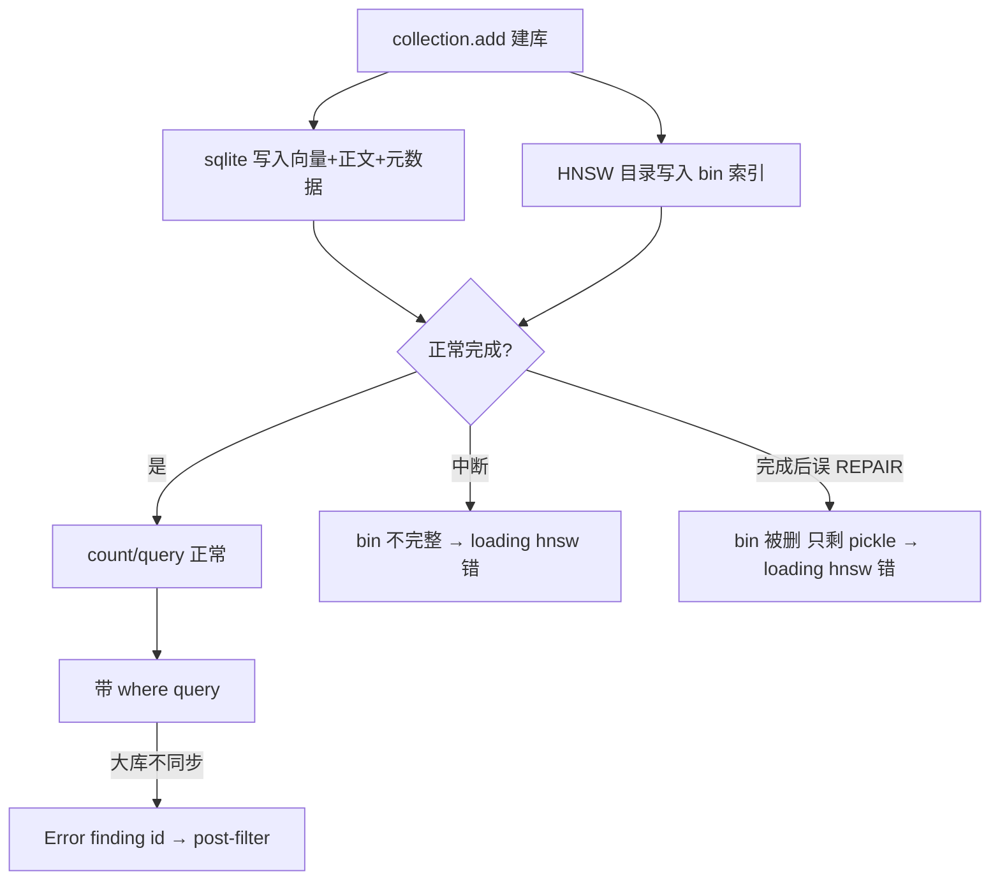

# 04 向量化与索引构建 — Q&A 笔记

> **用途**：个人知识点 Q&A（非交付文档）  
> 记录时间：2026-06-01  
> 对应任务：`04 向量化与索引构建/任务.txt`

---

## Q1：第四阶段到底在做什么？它在整个 RAG 项目中处于什么位置？

### 一句话概括

把第三阶段切好的**文本块（chunks）**转换成**数字向量**，存进一个能"按语义快速搜索"的数据库（ChromaDB），让后续的问答系统能够"找到相关文献片段"。

### RAG 的完整流程与我们的位置

RAG = Retrieval-Augmented Generation（检索增强生成）。它的核心思想是：**先检索到相关资料，再让大模型基于资料回答**，从而减少"幻觉"、让答案有据可查。

```
┌─────────────────────────────────────────────────────────────┐
│                     RAG 系统全流程                            │
├─────────────────────────────────────────────────────────────┤
│                                                              │
│  【离线建库阶段】 ← 我们现在做的                              │
│                                                              │
│  原始文献 → 解析 → 分块 → ★嵌入(向量化)★ → ★存入向量库★      │
│  (01验证)  (02)   (03)      (04 本阶段)      (04 本阶段)      │
│                                                              │
│  ─────────────────────────────────────────────────          │
│                                                              │
│  【在线问答阶段】 ← 后续阶段（LangChain RAG）                 │
│                                                              │
│  用户提问 → 问题向量化 → 向量库检索Top-K → 拼进Prompt → LLM   │
│                          ↑                                   │
│                    用的就是本阶段建好的库                     │
└─────────────────────────────────────────────────────────────┘
```

### 各阶段回顾与本阶段定位

| 阶段 | 做了什么 | 产出 |
|------|---------|------|
| 01 验证模型 | 验证本地 LLM + 数据源可行性 | 跑通 Ollama、Chroma smoke test |
| 02 数据处理 | 解析 500 万 XML、分析、定分割策略 | `oa_comm_slim.jsonl`（455 万篇） |
| 03 文档解析与分割 | 按策略切成文本块 | `oa_comm_chunks.jsonl`（610 万 chunks） |
| **04 向量化与索引** | **把文本块变向量、建可检索的库** | **ChromaDB 向量库 + 索引统计** |
| 后续 LangChain RAG | 接 LLM 做问答 | 完整问答系统 |

**关键认知**：第四阶段是"离线建库"的最后一步。做完这步，"知识库"就建好了，剩下的就是接上大模型来"用"这个库。

---

## Q2：什么是"嵌入模型"（Embedding Model）？

### 直观理解

**嵌入模型 = 把文字翻译成数字坐标的翻译器。**

计算机不理解文字，只会算数字。嵌入模型的作用就是把一段文本变成一串数字（叫"向量"），并且让**语义相近的文本，向量也相近**。

### 一个比喻

想象一张巨大的地图，每段文字是地图上的一个点：

- "糖尿病的治疗方法" 和 "如何医治糖尿病" → 这两个点离得很近（语义相似）
- "糖尿病的治疗方法" 和 "今天天气真好" → 这两个点离得很远（语义无关）

嵌入模型负责决定每段文字"该放在地图的哪个位置"。

### 文本 → 向量的过程

```
输入文本: "Diabetes is a chronic disease..."
              │
              ▼  嵌入模型（如 bge-small-en-v1.5）
              │
输出向量: [0.021, -0.045, 0.13, ..., 0.008]
          └──────────── 384 个数字 ────────────┘
```

这串数字（向量）就代表了这段文字的"语义指纹"。

### 为什么 RAG 需要它？

因为检索的本质是"找语义相近的内容"。有了向量，"找相似文本"就变成了"找距离近的点"——这是计算机非常擅长的数学运算（计算向量间距离/夹角）。

---

## Q3：什么是"维数"？为什么向量是 384 个数字？

### 维数的含义

**维数 = 嵌入模型输出向量的长度（包含多少个数字）。**

| 模型 | 维数 | 一个向量长这样 |
|------|------|---------------|
| all-MiniLM-L6-v2 | 384 | `[0.02, -0.04, ..., 0.01]`（384 个数） |
| bge-small-en-v1.5 | 384 | `[0.03, 0.11, ..., -0.02]`（384 个数） |
| bge-base-en-v1.5 | 768 | （768 个数） |
| bge-large-en-v1.5 | 1024 | （1024 个数） |
| OpenAI text-embedding-3-large | 3072 | （3072 个数） |

### 维数高低的权衡

**维数 ≈ 描述一段文字时使用的"特征数量"**。可以类比"用多少个角度去描述一个人"：

- 低维（384）：用身高、体重、年龄……384 个特征描述
- 高维（1024）：用 1024 个特征描述，能刻画更细微的差别

| | 高维（如 1024） | 低维（如 384） |
|---|---------------|---------------|
| 语义表达能力 | 更强、更细腻 | 够用、稍粗 |
| 存储占用 | 大（每条占用翻倍） | 小 |
| 计算速度 | 慢 | 快 |
| 内存/显存需求 | 高 | 低 |

### 对我们项目的实际影响

610 万 chunks 的存储估算（float32，每个数字占 4 字节）：

| 维数 | 单条向量大小 | 610 万条总大小（仅向量） |
|------|-------------|------------------------|
| 384 | 384 × 4 = 1,536 字节 | **约 9.4 GB** |
| 768 | 768 × 4 = 3,072 字节 | 约 18.8 GB |
| 1024 | 1024 × 4 = 4,096 字节 | 约 25 GB |

> 这也是我在计划中**建议用 384 维的 bge-small**、并把库放外接盘的直接原因之一。

---

## Q4：之前用的 all-MiniLM-L6-v2 和老师推荐的 BGE 系列有什么异同？

### 共同点

两者都是**句子嵌入模型（sentence embedding）**，都基于 Transformer 架构，都能把英文文本变成向量，都能在本地 CPU/GPU 上跑（不需要联网调 API）。

### 主要差异对比

| 维度 | all-MiniLM-L6-v2 | BAAI/bge-small-en-v1.5 | bge-base | bge-large |
|------|------------------|------------------------|----------|-----------|
| 出品方 | Microsoft / sentence-transformers | 北京智源研究院 (BAAI) | 同 | 同 |
| 维数 | 384 | 384 | 768 | 1024 |
| 模型大小 | ~80 MB | ~130 MB | ~440 MB | ~1.3 GB |
| 发布年份 | 2021 | 2023（更新） | 2023 | 2023 |
| 检索效果 | 基线水平 | **明显更好** | 更好 | 最好 |
| 是否需查询指令 | 否 | **是**（见下方 Q6 末） | 是 | 是 |
| 训练目标 | 通用句子相似度 | **专门为检索优化** | 同 | 同 |

### OpenAI 系列（付费）

| 模型 | 特点 | 我们是否用 |
|------|------|-----------|
| text-embedding-3-small/large | 效果好、维数高，但需联网 + **按量付费** | ❌ 不用（本项目本地化、免费优先） |

### clinicalBERT

任务书也提到了 clinicalBERT（医学专用），但备注"需自行微调"——意味着开箱即用效果不一定好，需要额外训练，**不适合现阶段**，所以不选。概念、医学 embedding 家族与微调流程见 **Q16**。

---

## Q5：维数相同（都是 384），为什么 bge-small 效果比 all-MiniLM 更好？

这是一个很好的问题，核心结论是：**维数只决定"向量有多长"，不决定"向量有多准"。准不准取决于模型是怎么训练出来的。**

### 打个比方

两个画家都用 **384 色**的调色盘（维数相同），但：

- 画家 A（all-MiniLM）：2021 年的普通美院学生，画得还行
- 画家 B（bge-small）：2023 年的专业画师，**专门练过"画检索图"这个题材**，用同样的调色盘能画得更传神

调色盘大小（维数）一样，但画功（训练质量）不同，成品质量就不同。

### 具体的技术原因

| 原因 | 说明 |
|------|------|
| **训练数据更新更多** | BGE 用了更大、更新、更高质量的语料训练 |
| **训练方法更先进** | BGE 用了对比学习 + 难负样本挖掘，专门优化"区分相关/不相关" |
| **任务针对性强** | BGE 是**为检索任务量身定制**的；all-MiniLM 是通用相似度模型 |
| **指令微调** | BGE 在查询端加指令（见下），进一步提升检索精度 |

### 客观证据：MTEB 榜单

MTEB（Massive Text Embedding Benchmark）是嵌入模型的权威评测榜。在英文检索任务上，bge-small-en-v1.5 的得分**明显高于** all-MiniLM-L6-v2，尽管两者都是 384 维。

> **一句话**：维数是"容量"，训练是"本事"。同样的容量，本事大的模型装的信息更精准。

---

## Q6：我们之前是怎么定的用 all-MiniLM-L6-v2？是任务书要求还是自己选的？jsonl 和维数什么关系？

### 6.1 是谁决定用 all-MiniLM-L6-v2？

**不是任务书指定的，是我们基于"实用基线"自己选的。**

来龙去脉：

| 阶段 | all-MiniLM 出现在哪 | 为什么用它 |
|------|-------------------|-----------|
| 01 验证模型 | Chroma smoke test 的**默认嵌入** | ChromaDB **内置默认**就是它（开箱即用） |
| 02 数据处理 | token 长度统计的 **tokenizer** | 为了和"将来要嵌入的模型"口径一致 |
| 03 文档解析 | 分割时计算 token 数的 tokenizer | 同上 |

也就是说：它是 **ChromaDB 的默认选择 + 业界常用基线**，我们顺势采用，作为"先跑通"的基准。**04 任务书是第一次明确推荐 BGE**，所以现在到了"从基线升级到更好模型"的时机。

### 6.2 ⚠️ 重要澄清：jsonl 和"维数"其实没有直接关系！

这里有个容易混淆的点，必须说清楚：

```
我们生成的 jsonl 里，根本没有向量！没有维数！
jsonl 存的是【纯文本 + 元数据】，向量是第四阶段才生成的。
```

我们之前生成的 `oa_comm_chunks.jsonl`，每一行长这样：

```json
{
  "chunk_id": "PMC176545",
  "text": "The Transcriptome of...\n\nPlasmodium falciparum is...",  ← 纯文本
  "doc_id": "PMC176545",
  "chunk_index": 0,
  "total_chunks": 1,
  "source_title": "The Transcriptome of...",
  "token_count": 480,        ← 注意：这是 token 数，不是维数！
  "strategy": "single"
}
```

**没有任何一个字段是向量。** 向量要等第四阶段，把 `text` 喂给嵌入模型才会产生。

### 6.3 那 all-MiniLM 和 jsonl 到底什么关系？—— 是 token，不是维数！

容易混淆的两个概念，必须分清：

| 概念 | 含义 | 在哪用 | 数值 |
|------|------|--------|------|
| **token（词元）** | 文本被切成的最小单位（分词） | 02/03 算长度、判断是否分块 | `token_count: 480` |
| **维数（dimension）** | 向量的长度 | 04 嵌入后才有 | 384 |

all-MiniLM-L6-v2 同时拥有两个组件：

```
all-MiniLM-L6-v2
├── tokenizer（分词器）  ← 02/03 阶段只借用了这部分来"数 token"
│     作用：把文本切成 token，数出 token_count，判断是否超 512
│
└── model（嵌入网络）    ← 04 阶段才会用这部分来"生成向量"
      作用：把 token 序列变成 384 维向量
```

**所以 02/03 阶段我们只用了它的"分词器"来统计长度（决定怎么切块），从来没用它生成过向量。**

### 6.4 换成 BGE 会不会影响之前切好的块？

**几乎不影响，无需重新分割。** 原因：

- 我们的 `chunk_size=400` 是按 all-MiniLM tokenizer 算的
- BGE 的 tokenizer 略有不同，但 BGE 的上限也是 512 tokens
- 400 tokens 的块换 BGE 分词后，依然稳稳在 512 以内
- 所以 03 阶段的成果可以直接拿来嵌入，不用重切

> 上面反复出现"512 tokens 上限"，这个 token 到底是什么、为什么会卡住分块策略，下面 Q7 专门讲清楚。

---

## Q7：token 是什么？它怎么影响分块策略？换 OpenAI / clinicalBERT 要重新分块吗？

### 7.1 token 是什么？

**token（词元）= 模型眼里文本的"最小处理单位"。**

模型不是按"字符"也不是按"单词"来读文本的，而是按 token。一个 token 可能是一个完整单词、一个词的一部分（子词），或一个标点。

举例（用 BGE/BERT 类分词器）：

```
原文:   "Diabetes is a chronic disease."
分词:   ["dia", "##betes", "is", "a", "chronic", "disease", "."]
token数: 7 个
```

注意 "Diabetes" 这种较长/较少见的词被拆成了 `dia` + `##betes` 两个 token。所以：

> **token 数 ≠ 单词数 ≠ 字符数**。经验上，英文 1 个单词平均约 1.3 个 token。

### 7.2 为什么模型有"512 tokens 上限"？

每个嵌入模型在训练时，都规定了一次最多能"读"多少个 token，这叫 **max_sequence_length（最大序列长度）**。

| 模型 | token 上限 |
|------|-----------|
| all-MiniLM-L6-v2 | 512（实际默认 256，可调到 512） |
| bge-small/base/large-en-v1.5 | 512 |
| OpenAI text-embedding-3-* | **8191** |
| clinicalBERT | 512 |

**超过上限会怎样？** 模型会把超出部分**直接截断丢弃**——也就是说，文本后半段根本没被"读"进去，生成的向量就丢失了信息。这正是我们要分块的根本原因：**保证每一块都能被模型完整读取，不被截断。**

### 7.3 token 上限如何决定分块策略？

回顾 02/03 阶段我们定的策略：

```
检索单元 = title + abstract
  ├─ token ≤ 512  → 不分块（一篇就是一个 chunk）   ← 约 85%
  └─ token > 512  → 滑动窗口分块（chunk_size=400）  ← 约 15%
```

这条策略的**每一个数字都来自模型的 token 上限**：

| 参数 | 值 | 为什么是这个值 |
|------|-----|---------------|
| 判断阈值 | 512 | 因为模型上限就是 512，超了会被截断 |
| chunk_size | 400 | 留出余量（< 512），避免边界情况超限 |
| overlap | 80 | 相邻块重叠，避免在句子中间硬切断语义 |

**核心逻辑链**：

```
模型 token 上限 (512)
      ↓ 决定
分块阈值 (512) 和 chunk_size (400)
      ↓ 决定
每篇文献切成几块、每块多长
```

所以——**分块策略本质上是"为某个特定 token 上限量身定制的"**。一旦换用 token 上限不同的模型，就要重新审视这条策略。

### 7.4 换模型是否需要重新分块？分情况看

判断标准只有一个：**新模型的 token 上限，和我们分块时假设的 512 是否一致/兼容。**

| 候选模型 | token 上限 | 与现有 400/512 策略 | 是否需重新分块 |
|---------|-----------|---------------------|---------------|
| **bge-small/base/large** | 512 | 完全一致 | ❌ **不需要**，直接复用 |
| all-MiniLM-L6-v2（原基线） | 512 | 一致 | ❌ 不需要 |
| **clinicalBERT** | 512 | **一致** | ❌ **理论上不需要重切** |
| **OpenAI text-embedding-3-*** | **8191** | 上限大得多 | ⚠️ **不必重切，但可优化** |

### 7.5 重点辨析你的问题

**① clinicalBERT 是否一定要重新分块？**

**不一定。** clinicalBERT 的 token 上限同样是 512，和我们的策略兼容，**400 tokens 的块不会被截断**，技术上可以直接复用现有 chunks。

但有两个**值得注意**的点（不是"必须重切"，是"可能想重切"）：

- clinicalBERT 的分词器是医学语料训练的，同一段文本切出的 token 数可能和 all-MiniLM 略有差异，但都在 512 内，影响极小。
- clinicalBERT 任务书标注"需自行微调"，开箱即用效果不保证——这是**不选它的主要原因**，与分块无关。

**② OpenAI 是否一定要重新分块？**

**不需要重切，但可以选择"重新设计策略"以更划算。**

- OpenAI 上限高达 8191 tokens，我们 400 tokens 的小块**完全不会被截断**，直接能用。
- 但 OpenAI **按 token 计费**。我们现在把一篇长摘要切成多块，会产生多次 API 调用 = 多花钱。如果用 OpenAI，反而可以**把块切得更大**（甚至一篇一块不切），减少调用次数、降低成本。
- 所以这里是"**为了省钱主动重新设计**"，而不是"**为了避免截断被迫重切**"。

### 7.6 一句话总结

> **分块策略是绑定模型 token 上限的。** 换成上限相同的模型（BGE、clinicalBERT、all-MiniLM 都是 512）→ **不用重切**；换成上限大得多的模型（OpenAI 8191）→ **不用被迫重切，但可为成本/效果主动优化**。我们选 BGE，所以 03 阶段成果可直接复用。

---

## Q8：ChromaDB 是什么？在 RAG 中起什么作用？怎么起作用的？

### 8.1 一句话定义

**ChromaDB 是一个"向量数据库"——专门存储向量、并能闪电般找出"最相似向量"的数据库。**

普通数据库（如 MySQL）擅长精确匹配："找出 name='张三' 的人"。
向量数据库擅长相似匹配："找出和这段话语义最接近的 5 段文字"。

### 8.2 在 RAG 中的作用

```
                  ChromaDB 是 RAG 的"知识仓库 + 搜索引擎"
                              
建库时（04阶段）：               查询时（后续问答阶段）：
                              
610万 chunk 的向量              用户问题 → 变成向量
   ↓ 存入                          ↓ 拿这个向量去问 ChromaDB
ChromaDB                       "谁和我最像？"
   ↓                              ↓
建好可检索索引                  ChromaDB 返回 Top-5 最相似的文献块
                                  ↓
                              这些块拼进 Prompt 喂给大模型回答
```

### 8.3 它是怎么实现"快速找相似"的？

如果暴力比较：用户问题向量要和 610 万个向量逐一算距离，太慢。

ChromaDB 用了 **HNSW 索引**（一种"近似最近邻"算法），可以理解为：

> 提前给 610 万个向量建好"路标网络"，查询时不用逐个比对，而是顺着路标几跳就能找到最近的邻居——从"逐个找"变成"导航找"，速度快几个数量级。

### 8.4 相似度怎么算？余弦相似度

我们计划用**余弦相似度（cosine similarity）**：看两个向量的"夹角"。

- 夹角越小（方向越一致）→ 越相似
- 这对文本检索效果最好，也是 BGE 推荐的度量方式

---

## Q9：我们之前阶段是怎么用 ChromaDB 的？和现在有什么区别？

### 9.1 第一阶段：只是 smoke test（冒烟测试）

01 阶段的 ChromaDB **不是真实建库**，只是验证"这个工具能不能用"。它的 notebook §6 明确写着：

> "本阶段**不做真实入库**，仅验证：chromadb 可正常初始化、内存模式可插入/查询、持久化目录可写。"

具体做的事：

```python
# 01 阶段 smoke test（简化）
# 只塞了几条假数据 d1, d2 测试
查询命中:
  - [d2] Hypertension is one of the most common cardiovascular risk factors.
  - [d1] Diabetes is a chronic disease characterized by elevated blood glucose.
```

用的是 ChromaDB **默认嵌入**（all-MiniLM-L6-v2 的 ONNX 版，自动下载 79MB），只为证明"管道通了"。

### 9.2 第四阶段：真实全量建库

| 对比项 | 01 阶段（smoke test） | 04 阶段（真实建库） |
|--------|---------------------|---------------------|
| **目的** | 验证工具能用 | 建生产级知识库 |
| **数据量** | 几条假数据 | **610 万真实 chunk** |
| **嵌入模型** | 默认 all-MiniLM（ONNX） | **BGE 系列**（计划） |
| **数据来源** | 手写测试句 | 03 阶段的 `oa_comm_chunks.jsonl` |
| **存储位置** | 本地临时目录 | **外接盘** `E:\...\chroma_db\` |
| **元数据** | 几乎没有 | **丰富**（见下） |
| **距离度量** | 默认（L2 平方） | **显式指定余弦** |
| **是否持久化复用** | 用完即弃 | 长期保存供问答阶段用 |

### 9.3 ⚠️ 生成内容的结构区别（不只是数据量变大）

你问得很准——**除了数据量增大，结构本身也有实质区别**：

**区别 1：元数据丰富度**

```
01 阶段：基本只有 id + 文本
04 阶段：每个向量都附带丰富元数据 ↓
{
  "doc_id": "PMC176545",
  "chunk_index": 0,
  "total_chunks": 1,
  "source_title": "The Transcriptome of...",
  "token_count": 480,
  "strategy": "single"
}
```

这些元数据让我们能做**过滤检索**（任务书§本周产出要求的"元数据过滤功能"），例如"只在 2020 年后的文献里搜"。

**区别 2：唯一 ID 规则**

04 阶段要求用 `doc_id + chunk_index` 作为唯一 id（任务书§2），保证每个块可精确定位回原文献的第几块。01 阶段没有这个规则。

**区别 3：距离度量显式化**

04 阶段会显式设置 `hnsw:space = cosine`（余弦），而 01 阶段用的是 ChromaDB 默认度量。这直接影响检索结果的排序质量。

**区别 4：嵌入模型不同 → 向量本身不同**

如果改用 bge-base（768维），连向量长度都变了；即便用 bge-small（仍 384 维），由于模型不同，**同一句话生成的向量数值也完全不同**。所以两个阶段的库不能混用。

### 9.4 为什么建议把 ChromaDB 数据放外接盘（E 盘）？

| 原因 | 说明 |
|------|------|
| **体积大** | 610 万向量 + HNSW 索引 + 元数据 + SQLite，合计约 **15-20 GB+** |
| **保护系统盘** | 系统盘（C/D）放这么大的库容易占满，影响系统运行 |
| **数据一致性** | 之前的 slim/chunks JSONL 都在 E 盘，库放一起便于管理 |
| **可移植** | 外接盘可拔插，库跟着数据走 |
| **Git 友好** | 这么大的库不能上传 Git（已在 `.gitignore` 忽略 `chroma_db/`），放外接盘天然隔离 |

---


## Q10：什么是"BGE 查询指令"？它有什么用？建库和查询时分别怎么起作用？

### 10.1 它是什么？

**BGE 查询指令（query instruction）= 在"用户问题"前面拼接的一句固定提示语**，告诉模型"我接下来给你的是一个用于检索的查询，请按检索的方式来理解它"。

官方推荐的英文指令是：

```
Represent this sentence for searching relevant passages:
```

实际拼接效果：

```
原始查询:  "What is the treatment for diabetes?"
加指令后:  "Represent this sentence for searching relevant passages: What is the treatment for diabetes?"
              └────────────── 指令前缀 ──────────────┘ └──────── 真正的问题 ────────┘
```

> ⚠️ 注意：指令只加在**查询**前面，**不会**加到被检索的文档（chunk）前面。

### 10.2 为什么需要它？——"非对称检索"问题

关键在于：**问题和答案在语言形态上是不对称的。**

```
用户问题（短、疑问句）：  "What is the treatment for diabetes?"
文档内容（长、陈述句）：  "Metformin is the recommended first-line therapy for type 2 diabetes..."
```

一个是简短的**提问**，一个是详尽的**陈述**。它们语义相关，但"长相"差别很大。如果直接把两者都嵌入，模型可能因为句式差异，算出来的相似度不够高，导致检索不准。

BGE 在训练时就专门处理了这种情况：**给查询端加上固定指令**，相当于给模型一个信号——"这是检索查询，请把它映射到'能匹配相关文档'的语义空间位置"。这样问题向量会更靠近真正相关的文档向量。

这种"查询和文档处理方式不同"的检索，就叫 **非对称检索（asymmetric retrieval）**。

### 10.3 在建库时（文档端）怎么作用？

**建库时不加指令，直接嵌入文档原文。**

```python
# 04 阶段建库：610 万 chunk 逐个嵌入，都不加指令
for chunk in chunks:
    vector = model.encode(chunk["text"])   # ← 原文直接编码
    collection.add(embeddings=[vector], ...)
```

原因：文档是"被搜索的内容"，它就该以本来的样子存在于向量空间里。给它加查询指令反而会扭曲它的语义位置。

### 10.4 在查询时（查询端）怎么作用？

**查询时必须加指令，再去检索。**

```python
# 后续问答阶段：用户提问
instruction = "Represent this sentence for searching relevant passages: "
query = "What is the treatment for diabetes?"

query_vector = model.encode(instruction + query)   # ← 加指令再编码
results = collection.query(query_embeddings=[query_vector], n_results=5)
```

加了指令的查询向量，会被"推"到更容易命中相关文档的位置，从而提升检索准确率。

### 10.5 全流程图

```
【建库阶段 04】 文档不加指令
  chunk 原文 ──encode()──> 文档向量 ──存入──> ChromaDB
                                                  │
                                                  │ （库建好了，长期保存）
                                                  ▼
【查询阶段 后续】 查询加指令
  用户问题 ──[加指令前缀]──> encode() ──> 查询向量 ──检索──> ChromaDB
                                                              │
                                                              ▼
                                                    返回 Top-K 相关 chunk
```

### 10.6 关键提醒（避坑）

| 要点 | 说明 |
|------|------|
| 只加在查询端 | 文档（chunk）嵌入时**绝不**加指令 |
| 建库和查询用同一模型 | 两端必须是同一个 BGE 模型，向量空间才一致 |
| 指令要用官方推荐的 | 英文用 `Represent this sentence for searching relevant passages:` |
| all-MiniLM 不需要 | 这是 BGE 特性；01 阶段的 all-MiniLM 无需指令 |
| 漏加指令的后果 | 不会报错，但检索准确率下降——属于"静默劣化"，要特别小心 |

### 10.7 一句话总结

> **BGE 查询指令是只加在"用户问题"前的一句固定提示语**，用来解决"短问题 vs 长文档"的非对称检索问题。**建库时文档不加、查询时问题才加**。漏加不会报错，但会悄悄拉低检索效果。

### 10.8 "自动加" vs "手动加"——以及一个常见误区

**先纠正一个容易混淆的点：BGE 查询指令和 LLM（如 deepseek-r1）无关。**

它属于**嵌入模型（embedding model）**这一侧的事，发生在"把查询文本变成向量"的环节；而 LLM 是后面"拿到检索结果再生成回答"的环节。两者是 RAG 里的不同部件：

```
用户问题 ──[嵌入模型] 编码（这里才涉及 BGE 指令）──> 查询向量 ──检索──> 相关chunk
                                                                          │
                                                          相关chunk + 问题 拼进 Prompt
                                                                          │
                                                                    ──[LLM] 生成回答──>
                                                          （这里和 BGE 指令无关）
```

所以正确说法是：**是否要"手动加"指令，取决于你用哪个嵌入模型的调用 API/封装库，而不是取决于 LLM。**

| 嵌入调用方式 | 是否自动加指令 | 要不要自己手动加 |
|--------------|--------------|-----------------|
| `sentence-transformers` 的 `model.encode(query)` | ❌ 不自动 | **要手动**拼接前缀 |
| `FlagEmbedding` 的 `model.encode_queries(query)` | ✅ 自动 | 不用，方法内部已加 |
| LangChain `HuggingFaceBgeEmbeddings.embed_query()` | ✅ 自动 | 不用，配置 `query_instruction` 后自动加 |

**结论**：

> "自动"不是模型的天性，而是某些封装库**替你做了手动拼接**。用最基础的 `encode()` 就得自己加；用 BGE 专用方法或 LangChain 封装则会在背后帮你拼。**模型本身不会凭空加。**

**避坑**：如果误以为"会自动加"但实际用的是不自动的 API → 代码不报错，但查询端漏指令 → 检索准确率静默下降。所以后续封装 `embedder.py` 时，应做成 `encode_documents()`（不加）和 `encode_queries()`（加）两个明确方法，从源头杜绝用错。

---

## Q11：为什么当前环境用不了 GPU？和 01 阶段的 requirements 有关吗？

### 问题

抽样验证 notebook C0 显示：

```
torch_version: 2.11.0+cpu
cuda_available: False
device: cpu
```

电脑已换为带 GPU 的 Windows，但嵌入仍在 CPU 上跑。全量 610 万 chunks 若继续用 CPU 会极慢。原因是什么？是否因为继承了 01 阶段的 `requirements.txt`？

### 答案（简短）

**有关，但不等于"requirements 写死了 CPU"。** 更准确的说法是：

> 01 阶段锁定的 `torch==2.11.0` **没有指定 CUDA 版本**；Windows 上按默认 PyPI 安装时，pip 会装 **CPU 版 wheel**（显示为 `2.11.0+cpu`）。01 阶段本来也不需要 PyTorch GPU，所以当时没有暴露这个问题。

### 因果链（从环境搭建到第四阶段）

```
Mac 上阶段 01 导出 requirements.txt
    ↓ 其中只有 torch==2.11.0（无 cu118/cu121 等后缀）
Windows 重装系统后 setup_windows_env.ps1
    ↓ pip install -r "01 验证模型/requirements.txt"
PyPI 默认给 Windows 装 CPU 版 PyTorch
    ↓ 版本显示 2.11.0+cpu，cuda_available=False
阶段 02/03 主要用 tokenizer 数 token（CPU 够用）
    ↓ 问题未暴露
阶段 04 全量嵌入 610 万 chunks
    ↓ 需要 GPU 加速 → 此时才发现环境是 CPU 版 torch
```

### 和 01 阶段 requirements 的具体关系

| 文件 | torch 相关写法 | 含义 |
|------|---------------|------|
| `01 验证模型/requirements.txt` | `torch==2.11.0` | pip freeze 锁定版本，**未区分 CPU/CUDA** |
| `01 验证模型/requirements_win.txt` | 同上 `torch==2.11.0` | Windows 专用列表，**同样未指定 CUDA** |
| `setup_windows_env.ps1` | `pip install -r requirements.txt` | 走默认 PyPI，**不会自动装 CUDA 版** |

**01 阶段为什么没问题？**

| 01 阶段用途 | 实际用的计算 | 是否需要 PyTorch GPU |
|------------|-------------|---------------------|
| 本地 LLM | **Ollama**（独立进程，不走 torch CUDA） | ❌ |
| Chroma smoke test | 默认 ONNX / 少量 CPU 嵌入 | ❌ |
| torch 在依赖里 | 被 LangChain / chromadb 等间接拉入 | 基本闲置 |

所以 01 的 requirements **继承到 Windows 后一直"能用"**，但装的是 **CPU 版 torch**，对 04 全量嵌入不够。

### "有 GPU 硬件" ≠ "PyTorch 能用 GPU"

需要同时满足：

| 层级 | 当前状态 | 说明 |
|------|---------|------|
| ① NVIDIA 显卡硬件 | ✅ 你有 GPU 电脑 | 硬件存在 |
| ② 显卡驱动（Driver） | 需本机已装 | 任务管理器 / `nvidia-smi` 可查看 |
| ③ **CUDA 版 PyTorch** | ❌ 当前是 `+cpu` | **缺这一环** |
| ④ `torch.cuda.is_available()` | ❌ False | ③ 的直接结果 |

`sentence-transformers` / 我们的 `DocumentEmbedder` 会调用 `torch.cuda.is_available()` 选设备；返回 False 就退回 CPU——**不是代码 bug，是 PyTorch 包类型不对**。

### 抽样 vs 全量：为什么现在还能跑、全量却建议先换

| 规模 | chunks 数 | CPU 是否可接受 |
|------|-----------|---------------|
| 抽样验证 | 1,267 | ✅ 可以（你已跑通） |
| 全量 | 6,107,296 | ❌ 强烈不建议（约 4800 倍工作量） |

### 全量前如何修复（操作步骤）

**1. 确认显卡驱动（可选但建议）**

在 PowerShell 中：

```powershell
nvidia-smi
```

能显示 GPU 信息说明驱动正常；若命令不存在，需先安装 NVIDIA 驱动。

**2. 卸载 CPU 版 torch，改装 CUDA 版**

```powershell
conda activate med-rag-verify
pip uninstall torch -y
pip install torch --index-url https://download.pytorch.org/whl/cu121
```

> `cu121` 表示 CUDA 12.1 构建。若安装失败，到 [PyTorch 官网](https://pytorch.org/get-started/locally/) 按你的 CUDA 版本选对应命令。

**3. 验证**

```python
import torch
print(torch.__version__)          # 应含 cu121 等，而非 +cpu
print(torch.cuda.is_available())  # 应为 True
print(torch.cuda.get_device_name(0))
```

**4. 重新跑 `vectorize-index-full.ipynb` 的 C0**，确认 `cuda_available: True` 后再建全量索引。

### 是否应改 requirements.txt？

| 做法 | 说明 |
|------|------|
| **不改 01 的 requirements.txt** | 它是 Mac 时期的全量锁定列表，改易破坏跨平台复现 |
| **04 requirements.txt 已写 GPU 说明** | 见 `04 向量化与索引构建/requirements.txt` 顶部注释 |
| **全量前手动换 CUDA torch** | 当前推荐做法；装完后可用 `pip freeze \| findstr torch` 记录实际版本备查 |

若希望 Windows 一键脚本未来自动装 GPU 版，可在 `setup_windows_env.ps1` 里把 torch 安装改为 PyTorch 官方 CUDA index——但需先确认本机 CUDA/驱动版本，**不宜盲目写进通用 requirements**。

### 一句话总结

> GPU 用不了，**根因是当前环境里装的是 PyTorch CPU 版（`2.11.0+cpu`）**；这确实与 **01 阶段 requirements 只写了 `torch==2.11.0` 且 Windows 默认 pip 装 CPU wheel** 有关，但不是 requirements "禁止 GPU"，而是 **从未指定、从未安装 CUDA 版**。01 用 Ollama 不需要 GPU；04 全量嵌入才需要，全量前按上文步骤换 CUDA 版 torch 即可。

---

## Q12：全量 C1 为何 Jupyter 内核崩溃？最终怎么修？

### 问题

`vectorize-index-full.ipynb` **C1** 运行到加载嵌入模型时，输出类似：

```
encode batch_size: 256
  model_name: BAAI/bge-small-en-v1.5
  device: cuda
  ...
The Kernel crashed while executing code in the current cell or a previous cell.
```

- 同一台机器上，**终端用 `python -c` 跑相同代码往往正常**
- 重装 `pyarrow`、重启电脑后，**Jupyter 里仍可能崩溃**

### 分析（分层排查）

| 层级 | 结论 |
|------|------|
| 表象 | 崩溃发生在 `embedder.dimension` → 懒加载 BGE 模型时 |
| 初判（易误判） | 以为是 CUDA / GPU 不可用 → 实际 C0 已显示 `cuda_available=True` |
| 初判（易误判） | 以为是 `pyarrow` 损坏 → `pip install --force-reinstall pyarrow` 对 CLI 有效，但 Jupyter 仍可能崩 |
| 根因 | 旧版 `embedder.py` 通过 **`sentence_transformers.SentenceTransformer`** 加载模型；该库 import 会拉起 **`datasets` → `pyarrow` → `pandas` → `sklearn`** 等 native 依赖链 |
| 为何 CLI 与 Jupyter 不一致 | VS Code/Cursor Jupyter 内核进程对 **Windows 上 pyarrow/sklearn 等二进制扩展** 更敏感，易触发 **access violation**（native crash，无 Python traceback） |
| 验证手段 | `python -X faulthandler` 可见崩溃栈指向 `pyarrow/__init__.py` 或 `sentence_transformers` 导入链 |

### 处理方法（已采用）

**不再经 `sentence_transformers` 加载模型**，改写 `src/embedder.py`：

| 项目 | 旧实现 | 新实现 |
|------|--------|--------|
| 加载 | `SentenceTransformer(..., device=cuda)` | `transformers.AutoModel` + `AutoTokenizer` |
| 池化 | ST 内置 | mean pooling + L2 归一化（BGE 标准做法） |
| 文档/查询 | `encode_documents` / `encode_queries` | **API 不变** |
| 依赖链 | 经 datasets/pyarrow | 仅 transformers + torch（CLI/Jupyter 均稳定） |

**操作步骤**：

1. 拉取最新 `src/embedder.py`
2. **Kernel → Restart**（避免内核缓存旧模块）
3. 从 **C0** 重跑到 **C1**
4. C1 建议 `batch_size=128`（12GB 显存笔记本）

### 相关：C2 SyntaxError（顺带修复）

若 C2 出现：

```text
BATCH_SIZE = 512\nRESUME = True\n...
SyntaxError: unexpected character after line continuation character
```

原因是 notebook cell 里误写了**字面量 `\n`** 而非真实换行；应改为三行：

```python
BATCH_SIZE = 512
RESUME = True
RESET = False
```

### 一句话总结

> C1 内核崩溃，**根因是 Windows Jupyter 下 `sentence_transformers` 导入链不稳定**；修复方式是 **`embedder.py` 改用 `transformers` 直载 BGE**，对外接口不变。与「有没有 GPU」是两件独立的事（GPU 问题见 Q11）。

---

## Q13：ChromaDB 向量库里到底存了什么？占盘结构是怎样的？

### 13.1 本工程入库时写了什么？

`index_builder.py` 每次 `collection.add()` 写入四类数据：

| 字段 | 来源 | 用途 |
|------|------|------|
| `ids` | `chunk_id`（= doc_id + chunk_index） | 唯一主键、断点续传对齐 |
| `embeddings` | BGE 文档端向量（384 维，L2 归一化） | 语义检索 |
| `documents` | chunk 的 `text` 全文 | 检索结果**直接返回正文**（与 JSONL 重复一份） |
| `metadatas` | doc_id、chunk_index、source_title、token_count、strategy 等 | 过滤、溯源 |

> **任务书未强制要求 `documents`**；这是 RAG 教程/Common 做法，检索一步出片段。正文也可只保留在 JSONL，检索后用 `chunk_id` 回表（约省 9 GB，见 Q13.4）。

### 13.2 磁盘上的目录结构（PersistentClient）

以 `.../chroma_db/` 为例（本工程全量 collection 名 `pmc_oa_comm_full`）：

```text
chroma_db/
├── chroma.sqlite3                    # 主库：collection 配置、embedding blob、documents、metadata
├── pmc_oa_comm_full.progress.json    # 【本工程自定义】断点行号，非 Chroma 内置
└── <uuid>/                           # 每个 collection 的 HNSW 向量索引（目录名随机）
    ├── header.bin
    ├── data_level0.bin               # HNSW 向量数据（体量随条数增长）
    ├── length.bin
    ├── link_lists.bin
    └── index_metadata.pickle
```

| 文件/目录 | 性质 | 说明 |
|-----------|------|------|
| `chroma.sqlite3` | Chroma 持久化核心 | 含 embeddings、documents、metadatas 等 |
| `<uuid>/` | HNSW 索引 | 加速近似最近邻检索；随 610 万向量显著增大 |
| `*.progress.json` | **我们写的** | `{"processed_lines": N}`，续传时跳过 JSONL 前 N 行 |

### 13.3 体积从哪来？（610 万条粗算）

| 组成部分 | 粗算体量 | 说明 |
|----------|----------|------|
| 向量 float32 | **~9.4 GB** | 6,107,296 × 384 × 4 字节 |
| chunk 原文（`documents`） | **~8–10 GB** | 与 JSONL 中 text 量级相当（多存一份） |
| HNSW + SQLite 结构 | **~50 GB+** | 随条数增长，是大头之一 |
| **Chroma 合计（含 documents）** | **~70–75 GB** | 实测 15.7 万条 ≈ 1.9 GB 线性外推 |

外接盘**总占用（含 JSONL）**：

- **方案 A（现方案，Chroma 含 documents）**：JSONL 9 GB + Chroma ~73 GB ≈ **~82 GB**（其中 ~9 GB 是正文重复）
- **方案 B（Chroma 不存 documents）**：JSONL 9 GB + Chroma ~64 GB ≈ **~73 GB**（正文只在 JSONL 一份）

**A 比 B 大约多 ~9 GB**；**70 GB 级总量**主要来自 **向量 + HNSW**，不是 JSONL 被存两遍就翻倍。

### 13.4 工程内 vs 外接盘（本次迁移）

| 阶段 | 输入 JSONL | ChromaDB | 说明 |
|------|------------|----------|------|
| 原始 C2 | E: | E: | USB HDD，读写易成瓶颈 |
| **C2.5** | `04.../data/processed/` | `04.../data/chroma_db_full/` | D: SSD 加速；`.gitignore` 不上传 |
| 完成后存档 | E:（保留或同步） | 拷回 `E:\...\chroma_db\` | 长期存储，RAG 阶段再挂载 |

### 13.5 一句话总结

Chroma 持久化 = **SQLite 主库 + HNSW 索引目录 +（可选）每条 chunk 原文**；本工程还用 **`progress.json` 断点**。全量 ~70 GB 主要是 **610 万向量与索引**，多存原文大约再多 **~9 GB**；任务书要求能检索到片段，**不要求**必须把原文放进 Chroma。**HNSW 是什么、为何报错、如何修复、对 RAG 的影响** → 见 **Q18**。

---

## Q14：资源监视器里 E: 仍在读 JSONL，是 C2.5 没解耦吗？中断后为何还能无报错续跑？

### 14.1 现象（2026-06-01 实测）

| 观察 | 内容 |
|------|------|
| 资源监视器 | E: 上 `oa_comm_chunks.jsonl` 有约 **4 MB/s 读取**；D: 上 `chroma_db_full\chroma.sqlite3-journal` 有写入 |
| 新开 cell 打印路径 | `INPUT_JSONL`、`PERSIST_DIR` **均在 D:**（工程内 `data/processed/` 与 `data/chroma_db_full/`） |
| 中断建库 cell 后 | E: **仍占用**；重启 Cursor 后 E: **彻底释放** |

看似矛盾：**变量指向 D:，监视器却显示 E: 在读 JSONL**。

### 14.2 原因分析：E: 占用未必来自当前 Notebook

| 结论 | 说明 |
|------|------|
| **C2.5 路径配置可以是对的** | 打印 `INPUT_JSONL` / `PERSIST_DIR` 是判断当前会话是否解耦的**可靠依据** |
| **E: 读 JSONL 可能是别的进程** | 排查期间 Agent 在后台跑过 `inspect_chroma.py`、Chroma `count()` 测试、大文件 hash 对比等，**未随对话结束而退出**，仍持有 E: 或 D: 文件句柄 |
| **重启 Cursor 释放 E:** | 说明占用来自 **IDE/后台 Python 子进程**，而非当前 C2.5b 必然读 E: |
| **如何区分** | 资源监视器 → 磁盘 → 查看对应进程：**`python.exe` 还是 `System`**；对 `python.exe` 看完整路径是否真是 E: 上 jsonl |

**教训**：全量跑时尽量少开并行 Python/Chroma 检测；若 E: 异常占用，先查 **任务管理器 / 资源监视器进程**，再查变量路径。

### 14.3 误操作提醒（与 E: 读有关的真实风险）

以下情况才会让 **当前 Notebook 真的读 E:**（与后台进程无关）：

| 情况 | 结果 |
|------|------|
| 跑过 **C2.5a 之后又重跑 C0** | `INPUT_JSONL` 被改回 E:，`PERSIST_DIR` 可能仍是 D: → **半解耦** |
| **跳过 C2.5a** 直接 C2.5b | `INPUT_JSONL` 仍为 C0 的 E: 路径 |
| 正确顺序 | **C0 → C1 → C2.5a → C2.5b**；**C2.5a 之后不要再跑 C0** |

### 14.4 中断后再次 C0→C1→C2.5a→C2.5b 为何能无报错续跑？（成功原因）

> 以下只记录机制，便于回顾；**正常跑时仍应避免随意中断**。

| 机制 | 作用 |
|------|------|
| **`progress.json`** | 每批 `flush()`（`collection.add`）成功后才写入 `processed_lines`；中断时进度停在**最后一批完整入库**之后 |
| **sqlite 中 embeddings** | 向量与文档在 `chroma.sqlite3`，**不随 Kernel 退出而丢失** |
| **`RESUME=True`** | `build_from_jsonl` 从 `processed_lines` 行继续读 JSONL，**不会重复 add 已完成批次** |
| **`REPAIR_HNSW=True`（C2.5a）** | 若上次中断导致 HNSW 目录损坏，启动前删损坏段；**sqlite 数据保留**，后续 `add` 时重建索引（**建库完成后勿再开**，见 **Q18**） |
| **C2.5a 覆盖路径** | 再次执行后 `INPUT_JSONL` / `PERSIST_DIR` 明确指向 D: 工程内目录 |
| **为何没再报 hnsw 错** | 修复 + 新 PersistentClient 打开的是 **`chroma_db_full`**；上次进度与 sqlite 一致即可 `count()` 并续跑 |

**不会丢进度的前提**：中断前至少完成过若干整批 `add`，且 **`progress.json` 与 sqlite 条数大致一致**（勿手动删一半文件）。

**续跑成本**：Kernel 重启后，`RESUME` 会从 JSONL **第 0 行扫描跳过**已处理行（约 15.7 万行时约 2.5% 文件），略耗时但**读的是 D: 上 JSONL**（路径正确时）。

### 14.5 一句话总结

> E: 仍 busy **不等于** C2.5 没解耦——先 **`print(INPUT_JSONL)`** 确认路径，再查 **是否有多余后台 Python**；本次 E: 占用主要来自 **排查脚本未退出**，重启 Cursor 后释放。中断后能续跑，靠的是 **`progress.json` + sqlite + REPAIR_HNSW + RESUME`**，不是「中断无害」，而是**断点设计 + 修复流程接住了**。

---

## Q15：从 RAG 最终效果看，换 `bge-base` 能显著提升吗？（多角度分析）

> 背景：全量建库期间观察到 GPU 显存仅用 ~4GB / 12GB（`bge-small` + `batch=128`），引发「是否该用 `bge-base-en-v1.5`」的讨论。Q14 已从**速度/磁盘**角度分析；本节从 **RAG 端到端效果** 分析，并给出本项目结论。

### 15.1 先定位：嵌入模型在 RAG 里管哪一段？

```
用户问题
  → 【嵌入 + 向量检索】← 04 阶段（bge-small / base 只影响这里）
  → Top-K chunk 文本
  → 【LLM 阅读上下文 + 生成答案】← 后续 LangChain_RAG 阶段
```

**换 base 只升级「检索排序」**，不直接提升 LLM 的推理、引用格式或幻觉控制。  
若 Top-3 里**本来就有**正确答案片段，small → base 对最终答案往往**几乎无感**；若相关片段排在第 8～15 名被截断，base **可能**把它抬进 Top-K，这时才有可见提升。

### 15.2 公开评测：small → base 有提升，但不如「MiniLM → small」那一步大

MTEB 英文检索类任务上（同一 BGE 家族、均配合查询指令），大致规律：

| 对比 | 相对关系 | 对本项目的含义 |
|------|----------|----------------|
| all-MiniLM → **bge-small** | **跃迁明显**（我们已从基线完成升级） | 04 选 small 相对 02/03 基线已是「效果向」决策 |
| **bge-small → bge-base** | **有提升，幅度中等**（通常几个点到十个百分点量级，视子任务而定） | 不是「再翻倍」，而是「好 → 更好一点」 |
| bge-base → bge-large | 边际更小 | 12GB 笔记本也不适合全量 large |

**要点**：维数 384→768 不等于效果也翻倍（见 Q5：维数是容量，训练才是本事）。  
base 比 small **参数更多、表示更细**，但在同一 BGE 检索训练框架下，属于**同一家族的递进**，不是换赛道。

### 15.3 医学 / PMC 语料：通用 base 的「领域加成」有限

| 角度 | 分析 |
|------|------|
| **语料** | 本库是 PMC 开放获取**英文生物医学**文献；BGE-small/base 均在**通用英文**上训练，**都不是**医学专用模型 |
| **任务书选项** | `clinicalBERT` 标注「需自行微调」——若真要「领域显著提升」，方向是 **领域模型 / 微调**，而非简单换 base |
| **文本特点** | 医学 chunk 含大量专有名词、拉丁学名、缩写；更大模型对**近义表述、跨段落指代**略好，但对**极冷门术语** small 与 base 都可能漏 |
| **结论** | 在**未做医学微调**前提下，base 相对 small 的增益主要是**通用检索能力**，不是「变成医学 embedding」 |

### 15.4 与本项目其它设计的关系：很多「效果杠杆」不在嵌入维数

| 因素 | 对 RAG 效果的影响 | 与换 base 的关系 |
|------|-------------------|------------------|
| **分块**（chunk_size=400, 阈值 512） | 块太大/太小都会伤检索；相关句是否被切散 | 换 base **不修复**坏块 |
| **610 万规模** | 相似文献多，Top-K 竞争更激烈 | base 可能改善**边界排序**，但噪声 chunk 仍多 |
| **BGE 查询指令** | 漏加则 small/base **一起变差** | 效果前提；见 Q10、schedule §注意事项 |
| **元数据过滤**（pub_year、doc_id 等） | 缩小候选集、提高精度 | 与嵌入模型**正交**，任务书本周产出之一 |
| **Top-K / 是否 rerank** | K 太小会截断；cross-encoder rerank 常比换 base **更划算** | 后续 RAG 阶段可加，无需重建全库 |
| **LLM 选型与 prompt** | 检索对了也可能答错或胡编 | base 管不到 |

任务书「检索结果不相关」的排查顺序也是：**先查 chunk 质量 → 查询指令 → 再试不同嵌入模型**——说明 **base 不是第一优先级**。

### 15.5 下游 LLM 视角：检索「够用」时，嵌入升级收益递减

典型 RAG 瓶颈转移：

```
检索 recall 很低     →  换更强 embedding 收益大        （MiniLM → BGE-small 曾处此区间）
检索 recall 已尚可   →  加 rerank、调 K、改 prompt 更划算
检索 recall 很高     →  LLM 整合、引用、幻觉成为主矛盾
```

本项目全量 + 抽样验证已通过**自相似、语义查询、元数据过滤**（见 `query_validation_sample.json`）。在**同样验证集**上 small 已过关的前提下，base 对「演示型 RAG 能跑通」的**边际贡献有限**；要证明 base 更好，需要 **同一批医学问句** 的 side-by-side 指标（如 Recall@5、MRR），而不是只看 GPU 空显存。

### 15.6 成本侧（效果权衡，非速度主论）

| 项 | bge-small（当前） | bge-base（若重跑） |
|----|-------------------|---------------------|
| 向量 + 索引体积 | ~9.4 GB 向量 + HNSW/元数据 | **约 2×** |
| 全量重建 | 已在进行 | 需**从头**建 `chroma_db_full`，进度作废 |
| 与 01/抽样索引一致 | ✅ 384 维统一 | 需另库或全部重建，**混用会检索失效** |
| 4080 12GB | 宽裕 | 可跑，batch 需下调 |

**效果收益：中等、不确定是否「显著」；工程成本：确定很高（全量重跑 + 双倍存储）。**

### 15.7 什么场景下值得考虑 base？

| 场景 | 是否值得 |
|------|----------|
| 全量跑完，用 **固定医学 QA 测试集** 测 Recall@K，small 明显不够 | ✅ 值得做 **子集 A/B** 或第二套 `chroma_db_base` |
| 用户问题与文献表述**差距大**（口语问、文献书面答） | ✅ base **略**有帮助，rerank 往往更明显 |
| 仅因 GPU 显存未满 | ❌ 不足以支撑重跑 |
| 希望「医学领域质变」 | ⚠️ 应评估 **微调 / 医学 embedding**，不是 base  alone |
| 实习演示：任务书要求的检索 + 过滤 + 样例 QA | ✅ **small 已满足**任务书；base 是加分项非必选项 |

### 15.8 本项目结论（效果向）

| 问题 | 结论 |
|------|------|
| base 能否提升 RAG？ | **能**，主要体现在 **Recall@K 边界 case** 与 **难查询排序**，不是全流程质变 |
| 是否「显著」？ | 相对 **MiniLM→small**：**不显著**；相对 **small 本身**：**中等、需实测**，不宜预期「答案质量翻倍」 |
| 当前全量是否应改 base？ | **不建议中断重跑**；先完成 small 全库 + 后续 RAG 联调 |
| 若要做效果验证 | 全量完成后：抽 **50～100 条医学问句**，同一 Top-K 对比 small vs base（可只对 **子集 jsonl** 建库，不必立刻 610 万×2） |
| 若仍不满意 | 优先 **cross-encoder rerank**、调 chunk/K/过滤；再考虑 base 或领域微调 |

### 15.9 一句话总结

> **bge-base 比 small「更好一点」有评测与机制支撑，但对本项目的 RAG 整体效果，更可能是「检索边界改善」而非「显著跃升」；我们已从 MiniLM 换到 BGE-small 吃到了最大一块红利。显存空余不反向证明 base 必选——若要以效果论升级，应用固定医学问句做 A/B，而不是在全量中途换模型重跑。**

---

## Q16：ClinicalBERT、医学 embedding 与「领域微调」是什么？若要做，流程大致怎样？

> 背景：任务书列出 `clinicalBERT（需自行微调）`；Q15 提到「领域质变」方向是 **clinicalBERT 微调 / 医学 embedding**。本节做概念梳理与流程概览，**不要求当前项目执行**——我们仍用 `bge-small-en-v1.5` 完成全量建库。

### 16.1 先分清三类「升级路径」

任务书里并列的选项，性质并不相同：

| 路径 | 代表 | 本质 | 要不要自己训 |
|------|------|------|--------------|
| **通用检索 embedding** | BGE-small / base | 大规模通用英文 + **检索对比学习** | ❌ 开箱即用 |
| **生物医学预训练 BERT** | ClinicalBERT、BioBERT、**PubMedBERT** | 在医学/生物文本上 **继续预训练**，更懂术语 | 权重可下载，**未必直接适合向量检索** |
| **医学检索专用 embedding** | **MedCPT**、社区 PubMedBERT-retrieval 模型 | 已在 **PubMed/PMC 检索** 上训过 | 多数可直接用 |
| **自己微调** | 在 ClinicalBERT / PubMedBERT 上再训 | 用 **你的语料 + 检索目标** 对齐向量空间 | ✅ 任务书「需自行微调」主要指这条 |

**「领域质变」** 通常指：对 `Plasmodium`、药物名、MeSH 术语、缩写（如 HF = heart failure）更敏感，**口语问句**也能对上 **PMC 书面表述**。  
BGE-small → base 是「通用检索 + 一点」；换 **PubMed 预训练** 或 **检索微调** 才是「换赛道」。

### 16.2 ClinicalBERT 是什么？为何任务书写「需自行微调」？

**ClinicalBERT**（Alsentzer 等，2019）大致过程：

1. 从 **BERT-base** 出发  
2. 在 **MIMIC-III 等临床病历**（英文、去标识化 notes）上 **继续预训练**  
3. 目标：更好表示 **临床叙述**（诊断、用药、病程）

与 **本项目的 PMC 开放文献（oa_comm）** 的关系：

| 模型 | 主要语料 | 与 oa_comm 贴合度 |
|------|----------|-------------------|
| **ClinicalBERT** | 医院 **病历** 文体 | 中（文体不同） |
| **PubMedBERT** | **PubMed 摘要 + PMC 全文** | ⭐ 高 |
| **BioBERT** | PubMed + PMC + 其他生物文本 | 高 |
| **MedCPT**（NLM） | PubMed **文献检索**（query/doc 双塔） | ⭐ 高，专为检索设计 |

任务书标注「需自行微调」的含义：

1. ClinicalBERT 最初是 **BERT 编码器**，服务分类 / NER / QA 等，**不是** BGE 那种现成的「句子向量 + 查询指令」产品。  
2. 要做 RAG **稠密检索**，还需：**池化（mean/CLS）+ 在 (query, 正例, 负例) 上做对比学习**。  
3. **不微调**就拿来当 embedding，医学词可能略好，但 **排序/Recall@K 不保证** 超过 BGE。

> Q4 已写：不选 clinicalBERT 的主因是 **工程量大、开箱效果不保证**，与分块/token 上限无关（同为 512，见 Q7）。

### 16.3 「医学 embedding」常指什么？

工程里 **医学 embedding** = 用生物医学向模型把文本变成 **固定维向量**（如 768 维），再进 Chroma 做余弦检索——只是向量空间更偏 **生物医学**，流程与 04 阶段相同。

除 ClinicalBERT 外，PMC / 医学 RAG 文献里更常出现：

| 模型 | 说明 |
|------|------|
| **PubMedBERT** | 仅用 PubMed+PMC 预训练；与本项目语料同源 |
| **BioBERT** | 生物 + 医学混合预训练 |
| **SciBERT** | 泛科学论文（偏 CS 等，医学非专精） |
| **MedCPT-Query / MedCPT-Article** | NLM 发布，**双塔检索**，可直接试 |
| **S-PubMedBert-MS-MARCO** 等 | 社区在 PubMedBERT 上再做检索微调 |

### 16.4 若要做 ClinicalBERT（或 PubMedBERT）检索微调：流程概览

对 **PMC 文献 RAG**，实践中常以 **PubMedBERT** 或 **MedCPT** 为起点；步骤与 ClinicalBERT 相同，只是 **基座与语料更贴 oa_comm**。

```
选基座 → 准备 (query, 正例 passage, 负例) 数据
      → 对比学习微调 encoder（mean pooling + 对比损失）
      → 验证 Recall@K
      → 全量重嵌入 + 重建 Chroma
      → RAG 查询端对齐同一模型/前缀
```

#### 步骤 0：明确目标

- **任务类型**：dense retrieval（稠密检索），不是文档分类。  
- **成功标准**：固定医学问句集上 **Recall@5 / MRR** 高于当前 BGE-small，而非只看 training loss。

#### 步骤 1：选 checkpoint（基座）

- **ClinicalBERT**：偏临床笔记场景  
- **PubMedBERT**：偏 **PMC 文献**（更贴本项目）  
- **MedCPT**：已偏检索，微调量可更小，或 **不微调先 A/B**

#### 步骤 2：准备训练数据（最关键）

需要 **三元组或成对样本**：

```
(query, relevant_passage, [irrelevant_passage...])
```

| 来源 | 做法 |
|------|------|
| **本项目 metadata** | `source_title` / 摘要句作 query，对应 chunk 作正例 |
| **PubMedQA、BioASQ** 等 | 公开生物医学 QA / 检索 benchmark |
| **合成数据** | LLM 据 chunk 生成问题（需人工抽检） |
| **In-batch negatives** | 同 batch 其他 chunk 当负例 |
| **Hard negatives** | 用当前 BGE 检索 Top-K 中「看似相关但标为负」的 chunk |

规模：**几千～几万对** 可做试点；要稳定超过 BGE，通常需 **更大数据 + harder negatives**。

#### 步骤 3：模型结构（sentence-transformers 范式）

1. `AutoModel` + `AutoTokenizer` 加载基座  
2. **Mean pooling**（对 token hidden 取平均，mask padding）  
3. 可选 **L2 归一化**（与 Chroma 余弦一致）  
4. **Query / Document 塔**：同一模型 + query 前缀（类 BGE）；或 **MedCPT 式双塔**（query 与 article 分开）

#### 步骤 4：训练

| 项 | 典型起点 |
|----|----------|
| 框架 | `sentence-transformers` 或 PyTorch + `MultipleNegativesRankingLoss` / InfoNCE |
| 超参 | lr 2e-5～5e-5，batch 32～128，epoch 1～3，max_length 512 |
| 硬件 | 单卡 GPU（4080 足够）；**训练** 常数小时～一天；**610 万全量嵌入** 是另一次大工程 |
| 验证 | 留 10%～20% 问句，每 epoch 看 Recall@K，防过拟合 |

#### 步骤 5：全量嵌入 + 建库（与 04 同构）

1. 微调模型的 `encode_documents` 扫 **`oa_comm_chunks.jsonl`**  
2. **必须重建** Chroma（模型/维数变了，**不能与 BGE 混用**）  
3. 查询端同一套 `encode_queries`（及约定 query 前缀）  
4. `index_stats.json` 记录模型名、维度、是否微调

#### 步骤 6：与 BGE A/B

同一批医学问句比 Recall@K、人工看 Top-3；若检索已够仍答不好 → 瓶颈在 **LLM / rerank**，不在 embedding。

### 16.5 三种方案对比（相对本项目）

| 方案 | 工作量 | 何时考虑 |
|------|--------|----------|
| **继续 BGE-small**（当前） | 最低 | 实习交付、全量进行中 |
| **换 MedCPT / PubMedBERT embedding（不自己训）** | 中：重嵌入 + 重建索引 | 想试领域模型、不写训练代码 |
| **PubMedBERT / ClinicalBERT 检索微调** | 高：数据 + 训练 + 全量重跑 | 有 QA 对 / 合成数据，且公开模型仍不够 |
| **仅继续预训练（无检索目标）** | 很高 | 偏研究；对 RAG 检索未必比「检索微调」划算 |

### 16.6 与本项目的直接关联

| 点 | 说明 |
|----|------|
| **分块** | PubMedBERT / ClinicalBERT 上限 **512 tokens**，`chunk_size=400` **可复用**，不必重跑 03 |
| **语料** | oa_comm 是 **PMC 文献** → 优先了解 **PubMedBERT / MedCPT**，不必默认 ClinicalBERT |
| **成本** | 610 万 chunk **重嵌入 + 索引** 与换 bge-base 同级；微调另加 **数据与实验** |
| **当前策略** | 先 BGE 全量 + RAG 联调；检索瓶颈明确后再 **子集 A/B**（MedCPT vs BGE 或小型微调） |

### 16.7 一句话总结

> **ClinicalBERT** 是「懂临床病历的 BERT 基座」；**医学 embedding / 领域质变** 通常还要在 **检索对** 上做 **对比学习微调**，或直接使用 **MedCPT** 等已训好的生物医学检索模型。流程核心是 **构造 query–passage 数据 → 微调 encoder → 全量重嵌入 → Recall@K 验证**——不是只换一个带 clinical 名字的 checkpoint。本项目现阶段 **不执行**，作扩展阅读即可。

---

## Q17：全量建库完成后的 C3–C5 验证问题（HNSW / count 崩溃 / 元数据过滤）

> 背景：2026-06-02 全量 **6,107,296** 条建库完成（D: `data/chroma_db_full/`）。重启 Notebook 跑 C3–C5 时连续遇到 Chroma / Jupyter 层问题；均已修复并验证通过。本节接 Q12–Q14 的「修正记录」续写。

### 17.1 全量完成后的正确验证路径（勿重跑建库）

Kernel 重启后内存中无 `builder`、路径会被 C0 改回 E:，但 **磁盘上的向量库已完整**。

| 步骤 | 是否必须 | 说明 |
|------|----------|------|
| C0 → C1 | ✅ | 环境 + `embedder` |
| **C2.5a** | ✅ | `COPY_FROM_E=False`，**`REPAIR_HNSW=False`**（建库已完成时） |
| **C2.5b 全量建库** | ❌ | 勿重跑（会扫 910 万行 JSONL） |
| **builder 初始化 cell** | ✅ | `ChromaIndexBuilder(...)` attach 已有库 |
| C3 → C5 | ✅ | 统计 + 检索验证 |

```
C0 → C1 → C2.5a → builder 初始化 → C3 → C4 → C5
```

修改 `index_builder.py` 后若不想 Restart Kernel：在 builder cell 前 **`importlib.reload(index_builder)`**（方式 B），再重建 `builder`。

### 17.2 C2.5a 再次报 `Error loading hnsw index`（stale pickle）

**现象**：`progress.json` 已是 6,107,296，但 C2.5a 末尾 `count()` 失败。

**诊断**（2026-06-02 实测）：

| 检查项 | 结果 |
|--------|------|
| `embeddings` 表 | **6,107,296** 行（数据未丢） |
| HNSW 目录 | 仅 **`index_metadata.pickle`**（~261MB），无 `data_level0.bin` 等 |
| 触发 | 建库完成后误开 **`REPAIR_HNSW=True`**，或 Chroma 1.5.9 compaction 异常 |

**机理**：`repair_chroma_hnsw()` 会 `rmtree` HNSW 段目录；Chroma 可能再写出 **不完整 pickle**，加载时期望完整二进制索引 → `Error loading hnsw index`。**不是 sqlite 丢数据。**

**处理**：

1. 删除 stale **`index_metadata.pickle`**（或运行增强后的 `repair_chroma_hnsw`）
2. 再次 `count()` → 恢复 **6,107,296**
3. 建库完成后 **勿再 `REPAIR_HNSW=True`**，除非 count 明确报 hnsw 错

**代码**：`index_builder.repair_chroma_hnsw` 已增加「仅有 pickle、无 bin 文件则删 pickle」逻辑；C2.5a 末尾 count 失败时会自动调用 repair 重试。

### 17.3 C3：`The Kernel crashed`（ExitCode 3221225477）

**现象**：C3 保存 `index_stats.json` 时内核直接退出，无 Python traceback；Jupyter 日志 `3221225477` = Windows **native 访问冲突**。

**原因**（叠加）：

| 因素 | 说明 |
|------|------|
| **`collection.count()`  on 610 万库** | `get_stats()` 内部再次 count；Chroma Rust 在大库 + Jupyter 下易 native 崩溃 |
| **原 C3 `import pandas`** | CLI 可 import，但 Jupyter 长会话 + 大库上下文下偶发加剧不稳定 |
| **前置 cell 已 count 一次** | builder 初始化 cell 若也调 count，C3 再 count 风险更高 |

**处理（已实现）**：

| 改动 | 作用 |
|------|------|
| `count_embeddings_sqlite()` | 从 `chroma.sqlite3` 读条数，绕开 Chroma count API |
| `get_stats(total_chunks=...)` | C3 传入 progress/sqlite 条数，**不再内部 count** |
| C3 去掉 pandas | stdlib 读前 5000 行算 token 统计 |
| builder 初始化 cell | 改用 sqlite 计数打印 |

**产物**：`outputs/tables/index_stats.json`（`total_chunks: 6107296`）。

### 17.4 C5 元数据过滤：`Error finding id`

**现象**：

```python
builder.query("circadian rhythm", where_filter={"strategy": "sliding_window"})
# InternalError: Error finding id
```

**对比**：

| 调用 | 结果 |
|------|------|
| `query` **无** `where` | ✅ 正常 |
| `query` **带** `where` | ❌ Error finding id |
| `collection.get(where=..., limit=3)` | ✅ 正常 |

**原因**：Chroma **1.5.9** 在全量大库上，metadata 索引与 HNSW 向量段可能 **不同步**（[GitHub #7032](https://github.com/chroma-core/chroma/issues/7032)）。`strategy=sliding_window` 约 **221 万条**，元数据本身无误。

**处理（已实现）**：`index_builder.query()` 捕获 `finding id` / `hnsw` 类错误后，自动 **over-fetch（≤500 候选）+ Python 按 metadata 过滤**，取 Top-K。

控制台可能打印（正常）：

```
[query] Chroma where= 失败，改用 over-fetch + Python 过滤 (InternalError)
```

**验证**：`outputs/tables/query_validation.json` → **`元数据过滤生效: true`**。

### 17.5 代码与 notebook 修改清单（回顾）

| 位置 | 修改 |
|------|------|
| `index_builder.py` | `count_embeddings_sqlite()`；`get_stats(total_chunks=)`；`repair_chroma_hnsw` 清理 stale pickle；`query()` post-filter 降级 |
| `vectorize-index-full.ipynb` | C2.5a count 自动重试；C3 无 pandas；builder 用 sqlite 计数；C4 不依赖 `df_sample`；C5 报告无 `collection.count()` |

### 17.6 交付物（全量验证通过后）

| 产物 | 路径 |
|------|------|
| 向量库 | `04.../data/chroma_db_full/`（~70GB sqlite + HNSW） |
| 索引统计 | `outputs/tables/index_stats.json` |
| 验证报告 | `outputs/tables/query_validation.json` |

### 17.7 一句话总结

> 全量建库完成后 **数据在 sqlite，验证靠 attach 而非重跑 C2.5b**；Chroma 1.5.9 在大库上 **`count()` / `where=`  query** 有坑——分别用 **sqlite 计数** 与 **post-filter 降级** 绕过；**建库完成后勿 `REPAIR_HNSW=True`**，以免 stale pickle 再次触发 hnsw 加载失败。HNSW 概念与修复机理详见 **Q18**。

---

## Q18：HNSW 目录是什么？为何报错？如何修复？对 RAG 有何影响？

> 背景：全量建库与 C3–C5 验证中多次出现 `Error loading hnsw index`、`Error finding id`。本节把 **HNSW 目录** 讲清楚，纠正「只是删了目录还有残留」的模糊印象，并说明 **修复做了什么、RAG 会不会变差**。

### 18.1 HNSW 是什么？在 RAG 里干什么？

**HNSW**（Hierarchical Navigable Small World）是一种 **近似最近邻（ANN）索引** 算法。

| 概念 | 说明 |
|------|------|
| **没有 HNSW 时** | 每次查询要把问题向量与 **610 万** 条 chunk 向量逐一算相似度 → 极慢 |
| **有 HNSW 时** | 在向量之间建「导航图」，按图快速跳到最相似区域 → **毫秒～秒级** 检索 |
| **在 RAG 里** | 用户问题 → BGE 取向量 → **HNSW 找 Top-K chunk** → LLM 读 chunk 作答 |

可以把它想成：**SQLite 是图书馆的书架（存书和编号），HNSW 是检索目录（告诉你在哪一排找相似的书）**。  
书还在书架上，但目录坏了或缺页，管理员（Chroma）会说「打不开目录」——这就是 **`Error loading hnsw index`**。

### 18.2 Chroma 持久化 = 两套东西，不是一份

Q13 已列目录结构；这里强调 **分工**：

```text
chroma_db_full/
├── chroma.sqlite3                 ← 【主数据】向量、正文、元数据、条数
├── pmc_oa_comm_full.progress.json ← 【本工程】断点，非 Chroma 内置
└── 5552215e-.../                  ← 【HNSW 段】仅索引，加速 query
        data_level0.bin            ← 向量索引本体（随条数增大）
        link_lists.bin
        length.bin
        index_metadata.pickle      ← 索引元信息（Chroma 1.5.x）
```

| 存储位置 | 存什么 | 丢了会怎样 |
|----------|--------|------------|
| **sqlite** | 610 万条 embedding、documents、metadatas | **RAG 核心数据**，丢失需重跑建库 |
| **HNSW uuid 目录** | 仅 **检索用索引结构**（可从 sqlite 重建） | **暂时无法 query/count**，数据仍在 sqlite |
| **progress.json** | 已处理 JSONL 行号 | 续传错位，与 HNSW 无直接关系 |

**关键结论**：报 hnsw 错 **≠** 610 万向量没了。我们实测 sqlite 里 **`embeddings` 仍为 6,107,296**。

### 18.3 建库时两者如何同步？

每批 `collection.add()` 时 Chroma 大致做两件事：

1. 把向量、文本、元数据 **写入 sqlite**（可靠、先落盘）  
2. 更新 **HNSW 段**（批量/compaction 时写 `data_level0.bin` 等）

正常跑完 C2.5b 时，**两边一致**，`query()` / `count()` 都能用。

### 18.4 三种「坏状态」——不要混为一谈

你的理解「中断 / C2.5a 会删 HNSW、还有残留」**方向对**，但具体错误分三类：

#### 状态 A：建库**中途手动中断**（早期 C2 on E:）

| 项 | 内容 |
|----|------|
| **发生了什么** | 某批 `add` 写到一半，HNSW 正在写 bin 文件时被掐断 |
| **磁盘表现** | uuid 目录里 **bin 文件不完整**，或 sqlite 与 HNSW 条数不一致 |
| **报错** | `Error loading hnsw index` |
| **sqlite** | 通常 **仍有** 已 flush 批次的 embedding（如 157,696 条） |
| **当时处理** | C2.5a `REPAIR_HNSW=True` → **删掉整个损坏的 uuid 目录**，续跑 `add` 时 **重建 HNSW** |

#### 状态 B：建库**已完成**后，又跑 `REPAIR_HNSW=True`（本次主因）

| 项 | 内容 |
|----|------|
| **发生了什么** | `repair_chroma_hnsw()` **`rmtree` 整个 HNSW 目录**（含完整 bin）；Chroma 再打开时尝试 compaction，只写出 **`index_metadata.pickle`（~261MB）**，**没有** `data_level0.bin` 等 |
| **磁盘表现** | uuid 目录 **只剩 pickle**，像「删了又留了一个半成品标签」 |
| **报错** | 仍是 `Error loading hnsw index`——加载器读到 pickle，找不到配套 bin |
| **sqlite** | **6,107,296 条完整仍在** |
| **为何像「残留」** | 不是 orphan 垃圾目录，而是 **Chroma 1.5.9 在「索引被删、数据仍在」时写出的 stale pickle**，比空目录更坑 |

> **纪律**：全量 **`progress.json` 已满** 后，C2.5a 应 **`REPAIR_HNSW=False`**，只改路径；**不要**对完好库再 repair。

#### 状态 C：`Error finding id`（C5 元数据过滤，**另一类问题**）

| 项 | 内容 |
|----|------|
| **发生了什么** | HNSW **能加载**，无 `where` 的 `query()` 正常；带 **`where={"strategy": ...}`** 时 metadata 索引与 HNSW 向量 id **不同步** |
| **报错** | `Error finding id`（不是 loading hnsw index） |
| **原因** | Chroma 1.5.x 大库已知问题（[#7032](https://github.com/chroma-core/chroma/issues/7032)），与状态 B 的 pickle 问题 **独立** |
| **处理** | `query()` **post-filter 降级**（见 Q17.4），**不删 HNSW** |



### 18.5 为何报错文案是「loading hnsw index」而不是「数据丢失」？

Chroma 的 `count()` / `query()` **默认先走 HNSW 段**（Rust 实现）。流程简化：

```
打开 PersistentClient
  → 读 sqlite 里 segment 表，找到 HNSW 的 uuid
  → 打开 uuid 目录下的 bin / pickle
  → 若文件缺失或格式不对 → InternalError: Error loading hnsw index
  → （不会继续告诉你 sqlite 里其实有 610 万条）
```

所以：**错误发生在「打开索引目录」这一步**，还没轮到读 sqlite 里的向量做检索。

### 18.6 我们的修复具体做了什么？

#### 修复 1：`repair_chroma_hnsw()`（针对状态 A、B）

| 步骤 | 行为 |
|------|------|
| 1 | 查 sqlite `segments` 表，找到本 collection 的 HNSW uuid |
| 2 | **`rmtree` 该 uuid 目录**（去掉损坏/多余的 bin 与 pickle） |
| 3 | **新增**：若目录里 **只有 pickle、没有 `data_level0.bin` 等** → **单独删 pickle** |
| 4 | 删除不在 segments 表里的 **orphan uuid**（抽样库混放残留） |
| **不碰** | **`chroma.sqlite3`**（向量、正文、元数据全部保留） |

#### 修复 2：删 stale pickle 之后 Chroma 如何恢复？

实测（2026-06-02）：

1. 将 `index_metadata.pickle` 重命名为 `.bak`（或 repair 删除）  
2. 再次 `PersistentClient` + `collection.count()`  
3. **成功返回 6,107,296**；随后 **无 where 的 `query()` 正常**

机理（简化）：pickle 去掉后，Chroma **compactor 从 sqlite 中的 embedding 重新构建/加载 HNSW**，不再试图打开那份坏的 pickle。

#### 修复 3：C2.5a notebook 自动重试

count 失败且报错含 `hnsw` → 自动调用 `repair_chroma_hnsw` → 再 count 一次。

#### 修复 4：与 HNSW 无关但常一起出现的

| 问题 | 修复 |
|------|------|
| C3 反复 `count()` 内核崩溃 | `count_embeddings_sqlite()`，不经过 HNSW API |
| C5 `where=` Error finding id | post-filter，**不删 HNSW** |

### 18.7 对后续 RAG 的影响

| 问题 | 结论 |
|------|------|
| **向量 / 正文 / 元数据是否完整？** | ✅ sqlite 未删，**6,107,296 条完整**；RAG 检索内容无损失 |
| **语义检索质量是否下降？** | **正常 query（无 where）**：修复后与建库完成时 **同一套 HNSW + 同一批 BGE 向量**，**不应变差** |
| **带 metadata 过滤的 query** | Chroma 原生 `where=` 在大库不可靠；我们用 **多取候选再 Python 过滤**，结果 **语义排序仍来自 BGE+HNSW**，过滤逻辑正确；Top-K 略小于「理想全局过滤」（只在前 500 候选里筛），对演示级 RAG **可接受** |
| **性能** | 首次 pickle 删除后 Chroma 可能 **lazy 重建** 索引；之后 query 速度与建库完成时同级 |
| **需要重嵌入吗？** | ❌ **不需要**；除非 sqlite 损坏或换 embedding 模型 |
| **存档到 E: 时要注意什么？** | 拷贝 **整个 `chroma_db_full/`**（sqlite + uuid 目录 + progress.json），不要只拷 sqlite |

**一句话（RAG）**：修复动的是 **「检索电话簿」**，不是 **「书的内容」**；RAG 用同一 BGE 模型、同一批 chunk 即可；唯一工程妥协是 **大库 metadata 过滤走 post-filter**（已在 `index_builder.query` 封装）。

### 18.8 操作纪律（避免 HNSW 再坏）

| 场景 | 建议 |
|------|------|
| 建库**未完成**、count 报 hnsw | `REPAIR_HNSW=True`，再 `RESUME=True` 续跑 |
| 建库**已完成**（progress = 6107296） | C2.5a **`REPAIR_HNSW=False`** |
| 验证 C3–C5 | attach builder，**勿重跑 C2.5b** |
| 统计条数 | 用 **progress / sqlite**，少调 `collection.count()` |
| 后续 LangChain RAG | 继续用 **`ChromaIndexBuilder.query()`**，自动带 BGE 指令 + post-filter 降级 |

### 18.9 一句话总结

> **HNSW 目录** = Chroma 为 610 万向量建的 **快速检索索引**（uuid 文件夹里的 bin/pickle），**不是**向量本体；向量在 **sqlite**。中断或误 repair 会导致 **索引文件不完整或只剩 stale pickle**，从而 `Error loading hnsw index`，但 **sqlite 数据通常仍在**。修复 = **删掉坏的 HNSW 文件、保留 sqlite**，让 Chroma **从 sqlite 重建索引**；**不重新 embedding**，对 RAG **检索质量无本质损失**，metadata 过滤则用 **post-filter** 绕过 Chroma 大库 bug。

---

## 总结表

| 疑问 | 结论 |
|------|------|
| 第四阶段做什么 | 把文本块变向量、存进可检索的 ChromaDB（RAG 的"建库"收尾） |
| 嵌入模型是什么 | 把文字翻译成"语义坐标向量"的模型 |
| 维数是什么 | 向量的长度（数字个数）；高维更精细但更占空间 |
| 为何 bge-small > all-MiniLM | 维数（容量）相同，但 BGE 训练更新、专为检索优化（本事更大） |
| all-MiniLM 是谁定的 | 不是任务书，是 ChromaDB 默认 + 业界基线，我们顺势采用 |
| jsonl 和维数关系 | **没有直接关系**！jsonl 存纯文本，没有向量；02/03 只用了它的 tokenizer 数 token |
| token 是什么 | 模型眼里文本的最小处理单位；token 数 ≠ 单词数 ≠ 字符数 |
| token 怎么影响分块 | 模型有 token 上限（超出会截断丢信息），分块阈值 512、chunk_size 400 都由此而来 |
| 换 BGE 要重切块吗 | 不用，BGE 上限也是 512，400 tokens 的块不会被截断 |
| 换 clinicalBERT 要重切吗 | 不一定要，它上限也是 512，技术上可复用（不选它是因"需微调"，与分块无关；详见 **Q16**） |
| 换 OpenAI 要重切吗 | 不必被迫重切（上限 8191），但可为省钱/效果主动把块切大 |
| ChromaDB 作用 | RAG 的"知识仓库 + 语义搜索引擎"，用 HNSW 索引快速找相似 |
| 与 01 阶段区别 | 01 是 smoke test（假数据）；04 是真实全量，元数据更丰富、显式余弦、放外接盘 |
| 为何放外接盘 | 库体积 15-20GB+，保护系统盘、与数据集统一管理、Git 隔离 |
| **为何 GPU 不可用** | **PyTorch 为 CPU 版（2.11.0+cpu）**；01 requirements 只锁 `torch==2.11.0`，Windows 默认 pip 装 CPU wheel |
| **全量前怎么办** | 卸载 torch → 从 PyTorch 官方 index 装 CUDA 版 → C0 确认 `cuda_available=True` |
| **C1 内核崩溃怎么办** | `embedder.py` 已改 `transformers` 直载；Kernel Restart 后从 C0 重跑；见 Q12 |
| **Chroma 里存什么** | 向量 + 元数据 +（可选）chunk 原文 + HNSW；见 Q13；**HNSW 详解见 Q18** |
| **全量加速怎么跑** | 跳过 C2，用 **C2.5** 迁 D: 续跑；见 Q14 路径与 E: 占用辨析 |
| **换 bge-base 能否显著提升 RAG** | **中等、边界改善为主**；不如 MiniLM→small；全量中途不建议改；见 **Q15** |
| **ClinicalBERT / 医学 embedding / 微调** | 领域检索另辟赛道；PMC 更贴 PubMedBERT/MedCPT；流程见 **Q16** |
| **全量完成后 C3–C5 怎么跑** | C2.5a（勿 REPAIR）→ builder attach → C3–C5；见 **Q17** |
| **C3 内核崩溃 / C5 where 报错** | sqlite 计数 + post-filter；stale pickle 见 Q17.2–Q17.4 |
| **HNSW 目录是什么 / 为何报错 / 对 RAG 影响** | 索引 vs sqlite 分工；三种坏状态；修复不丢向量；见 **Q18** |

---