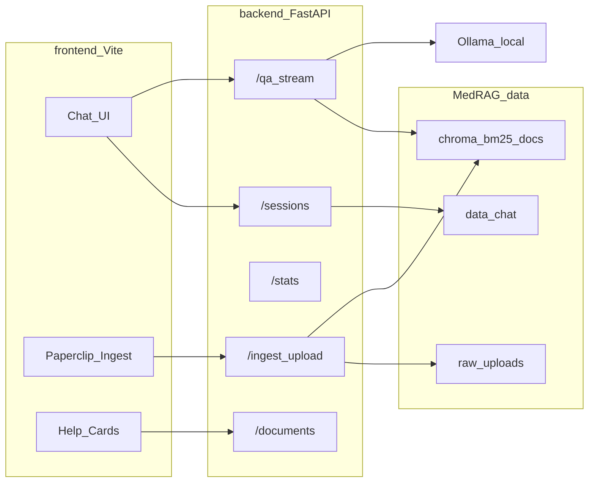

# Med-RAG 最终打包计划

> **状态**：✅ P0–P4 已落地（Demo 可运行；Docker 二期可选）  
> **日期**：2026-08-06  
> **落点**：仓库根目录 [`Med-RAG/`](../Med-RAG/)  
> **上游**：01–12 已完成成果 · [`02schedule.md`](02schedule.md) · [`（未来优化）打包后数据更新/schedule.md`](../（未来优化）打包后数据更新/schedule.md) · 导师认可方案见 [`任务.txt`](任务.txt)

---

## 1. 目标与边界

**目标**：在仓库内划出可独立运行的 `Med-RAG/`，整合已验证的医学 RAG（检索 → 约束生成 → FastAPI 11/12）+ React 演示前端，做到：本地问答可视化、会话可追溯、支持空库冷启动与附件式语料更新，并提供代码说明 / 部署文档 + zip 压缩包（GitHub 同仓可览）。

**边界**：

- 不重写 03–10 算法内核；以拷贝/适配方式迁入，路径全部改为 `Med-RAG` 内相对路径。
- **一期不阻塞于 Docker**：主交付为「FastAPI + React 本地双进程 + 详细环境/部署文档 + zip」。Compose 仅作二期可选项（Ollama / 大数据 volume 外挂）。
- 运行时**禁止**依赖仓库外阶段目录（`../11`、根 `Dataset/` 等）；试用时手动迁入的数据也必须落在 `Med-RAG/data/`。

---

## 2. 已锁定决策

| 项 | 决策 |
|----|------|
| 落点目录 | 仓库根 `Med-RAG/` |
| 代码策略 | **自包含拷贝**核心链路（05–12 运行时 + 02–04 入库工具子集），非跨目录 import |
| Demo 默认模式 | `sample`（小语料可空启动提示；有样本索引则直接问答） |
| 全量 | 可选：将资产放入 `Med-RAG/data/` 后改 env 为 `full` |
| 会话/聊天记录 | 落盘 `Med-RAG/data/chat/`（替换/扩展现有内存 `MemorySessionStore`） |
| 前端 | React + Vite；布局参考 [`前端参考/QA.webp`](前端参考/QA.webp) |
| 初始区卡片 | 示例问答 / API 说明 / 代码原理 / 流程图（链到 docs 或站内页） |
| 回形针按钮 | 打开「语料更新」面板（上传 → 调用包内处理管线） |
| 打包形态 | zip + Git 文件夹；Docker/compose 二期评估 |
| LLM | 继续本机 **Ollama**（`deepseek-r1:7b`），与现 11/12 一致 |

---

## 3. 目标目录结构

```text
Med-RAG/
├── README.md                 # 包入口（如何启动 demo）
├── .env.example
├── requirements.txt          # 后端合一依赖
├── backend/                  # FastAPI（自 11+12 合并，路径本地化）
│   ├── app/                  # api / services / bridge 合一
│   ├── rag/                  # 05–10 管线 vendored
│   ├── ingest/               # 02–04 解析/切块/嵌入/入库（空库与更新用）
│   └── scripts/run_api.py
├── frontend/                 # React + Vite
│   ├── src/pages|components|api
│   └── ...
├── data/                     # 运行时数据（大文件 gitignore；保留 README/.gitkeep）
│   ├── chroma/  bm25/  documents/  processed/  raw_uploads/
│   └── chat/                 # 会话与前端侧历史 JSON
├── docs/
│   ├── 代码说明文档.md
│   ├── 部署文档.md
│   └── 流程图.md（或 assets）
└── scripts/                  # 打包 zip、空库检查、样本数据引导
```

---

## 4. 架构关系



---

## 5. 分阶段实施

### P0 — 骨架与路径隔离

- 创建上述目录；`dataset_paths` 等价物改为 `Med-RAG` 根相对（可用 `MED_RAG_HOME`）。
- `.gitignore`：忽略 `data/**` 大文件与 `node_modules`，保留结构说明。
- 空库探测：`/ready` / 前端启动时提示「无索引 → 引导上传或放入样本资产」。

### P1 — 后端整合迁移（优先）

- 合并 12 `app` + 11 bridge 为单一 `backend/app`。
- Vendor 10 `ConstrainedGenerationPipeline` 及 05–09 依赖；所有 `resolve_*` 只读 `Med-RAG/data/`。
- **会话持久化**：文件后端写入 `data/chat/`（列表/搜索/新建/删除与 12 sessions API 对齐；进程重启可恢复）。
- 补 **CORS**（Vite 开发源）。
- 新增最小 **ingest API**（上传落 `raw_uploads` + 异步/同步状态）；内部调用 `backend/ingest`（自 02–04 精简），增量策略对齐未来优化 schedule（documents upsert；Chroma add；BM25 一期可「小库重建 / 标记待重建」）。
- 默认 `MED_RAG_RETRIEVAL_MODE=sample`；无数据时 QA 返回明确业务错误而非崩溃。

### P2 — React 前端 Demo

- 布局：左栏品牌 + New Chat + 搜索 + 历史；右栏空态英雄区 + 四卡片 + 输入框（回形针 = 语料更新）。
- 对接：`POST/GET/DELETE /sessions`、`POST /qa`（及伪流式若时间允许）、可选 `stats/health` 状态条。
- 历史搜索：前端过滤 `data/chat` 经 API 返回的标题/摘要。
- 四卡片：链到站内「示例问答 / API 说明 / 原理 / 流程图」（内容可先占位，P3 文档齐后填实）。
- 视觉：参考 QA.webp 的双栏与输入区结构；品牌改为 Med-RAG / 医学问答。

### P3 — 文档与注释

- `docs/代码说明文档.md`：目录、管线阶段对应 01–12、关键类入口。
- `docs/部署文档.md`：Conda/`med-rag-verify` 或独立 venv、Ollama、样本数据放置、前后端启动、端口、常见缺文件处理。
- 迁入代码补齐模块 docstring / 包边界注释（不改算法语义）。

### P4 — 发布打包

- `scripts/make_release_zip.ps1`：打出不含巨量 `data/` 的源码+文档包；另附「数据放置说明」。
- 仓库内 `Med-RAG/` 可直接经现有 Git 链接查看。
- **Docker 评估节点**（P1 完成后）：若仅 API+前端可容器化而 Ollama/Chroma 宜外挂，再补 `compose` 草稿；否则维持文档化手动部署为正式方案。

---

## 6. 与既有计划的关系

- [`02schedule.md`](02schedule.md)：资产挂载 / 单机编排思路保留；本计划把「前端 Demo + 自包含目录 + 空库/更新」补全为正式路线。
- [`（未来优化）打包后数据更新/schedule.md`](../（未来优化）打包后数据更新/schedule.md)：回形针更新走增量补丁思路；全量重建作保底，不在 Demo 一期做 610 万重嵌。

---

## 7. 验收标准（Demo）

- 仅依赖 `Med-RAG/` + 本机 Ollama，sample 数据就位时可：新建会话 → 提问 → 左侧出现历史 → 刷新后仍在。
- 空 `data/` 启动：服务与 UI 可开，问答/检索给出可理解引导；上传小样本 XML/JSONL 后能完成最小入库并可再问。
- `/docs` OpenAPI 与前端主要操作一致；代码说明 + 部署文档可读通。
- 产出 zip；导师可通过仓库 `Med-RAG/` 浏览。

---

## 8. 建议开工顺序

1. 写入 `final-schedule.md`（本计划）
2. P0 骨架
3. P1 后端（含 chat 落盘 + CORS + 空库）
4. P2 前端壳 + API 接线
5. P1 ingest 最小闭环 + 回形针 UI
6. P3 文档
7. P4 zip；再评估 Docker

---

## 9. 进度记录

| 日期 | 事项 |
|------|------|
| 2026-08-06 | 定稿 final-schedule；开始在 Med-RAG/ 落地 P0–P4 |
| 2026-08-06 | **P0–P4 落地**：自包含 backend（11+12 合一 + vendor 04–10）· FileSessionStore · CORS · ingest API · React Demo · 代码/部署/流程图文档 · release zip 脚本；Docker 一期不阻塞（见 `scripts/docker/README.md`） |
